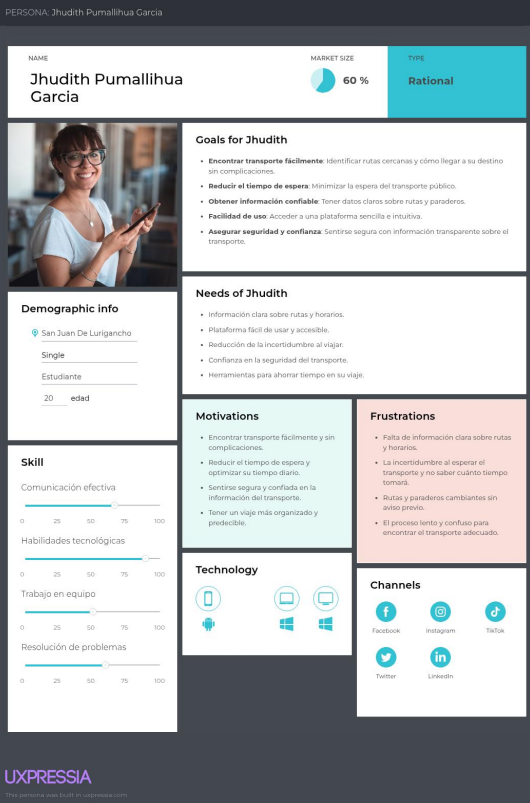
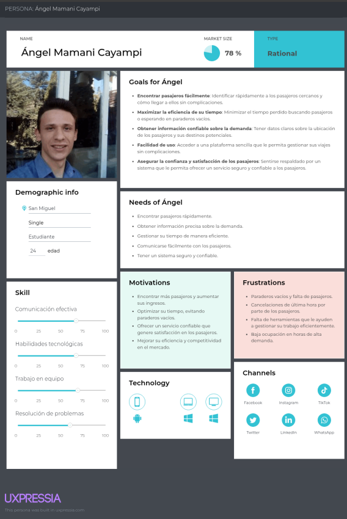
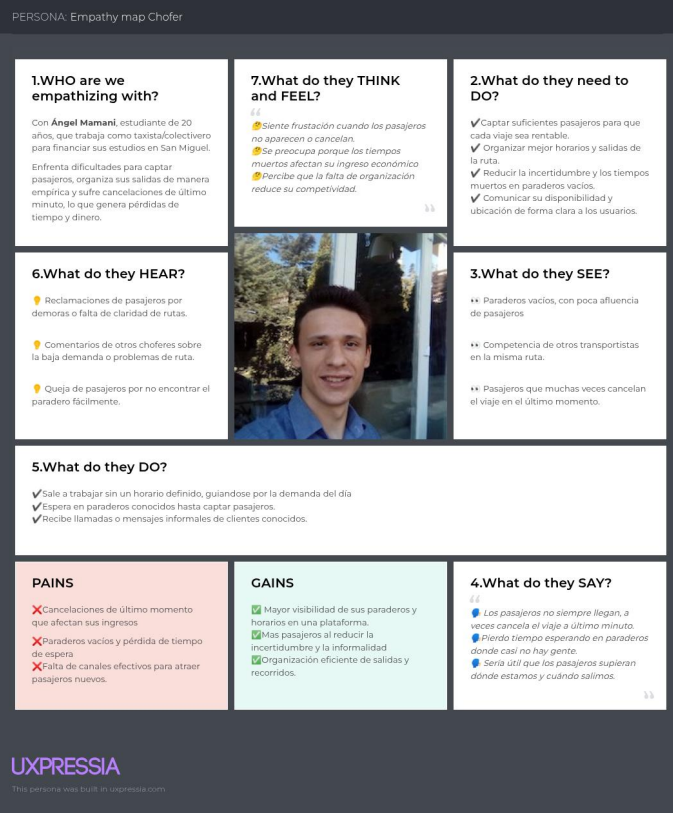
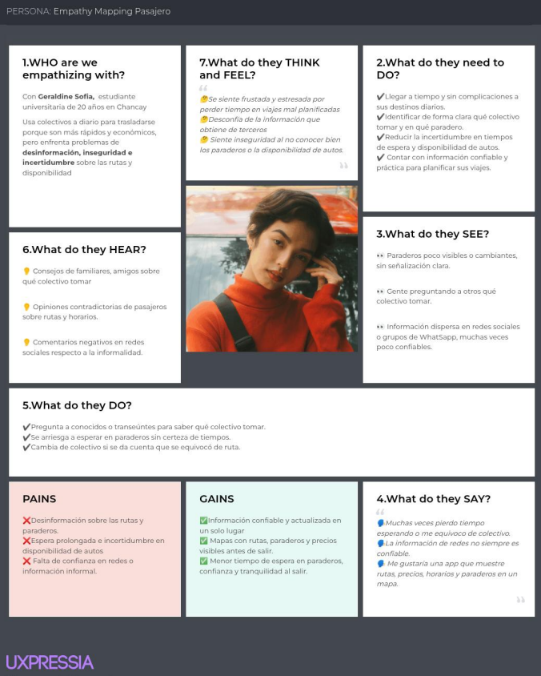
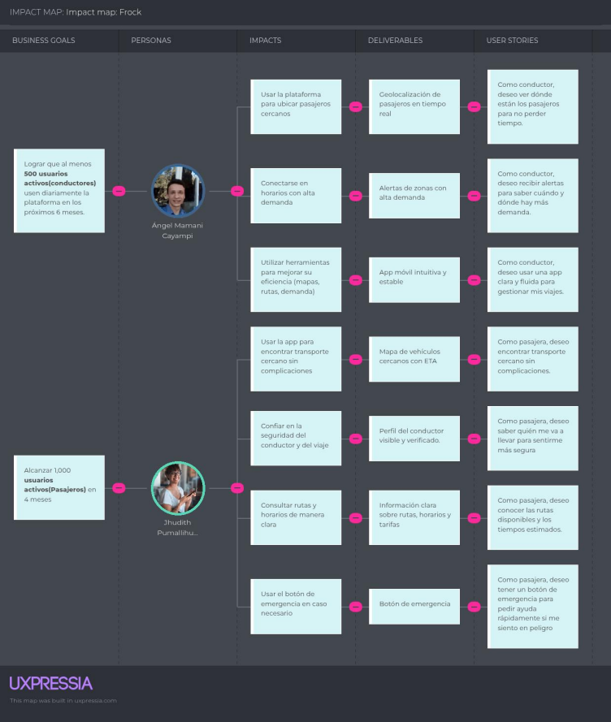
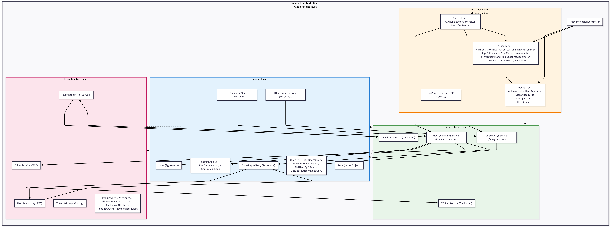

      
    <strong>Universidad Peruana de Ciencias Aplicadas</strong> 
    <strong>Ingeniería de Software / Séptimo Ciclo</strong>  
    <strong> Aplicaciones para dispositivos Móviles </strong>  
    2026-10  
    <strong>NRC:</strong> 3821  
    <strong>Profesor:</strong> Mayta Guillermo, Jorge Luis   
    <strong>Nombre del Producto: FirstCommit </strong>   
    <strong>Integrantes:</strong>

  
  <table border="1px" align="center">
    <thead>
        <tr>
            <th>
Apellidos, Nombres
</th>
            <th>
Código
</th>
        </tr>
    </thead>
    <tbody>
        <tr>
            <td>
Velarde Gonzales, Néstor Hernán
</td>
            <td>
U20211C221
</td>
        </tr>
        <tr>
            <td>
Curi Marcelo, Angelo Marcio
</td>
            <td>
U202022387
</td>
        </tr>
        <tr>
            <td>
apellido, nombres
</td>
            <td>
codigo
</td>
        </tr>
        <tr>
            <td>
apellido, nombres
</td>
            <td>
codigo
</td>
        </tr>
        <tr>
            <td>
apellido, nombres
</td>
            <td>
codigo
</td>
        </tr>
    </tbody>
  </table>

    

<strong>Lima, 16 de abril del 2026</strong> 

# Registro de Versiones del Informe

<table border="1px" align="center">
    <thead>
        <tr>
            <th>Versión</th>
            <th>Fecha</th>
            <th>Autor(es)</th>
            <th>Descripción de la modificación</th>
        </tr>
    </thead>
    <tbody>
        <tr>
            <td>1.0</td>
            <td>05/04/2026</td>
            <td>Velarde Gonzales, Néstor Hernán</td>
            <td>Creación inicial del documento</td>
        </tr>
    </tbody>
</table>

# Project Report Collaboration Insights

# Contenido

- [**Capítulo I: Presentación**](#capítulo-i-presentación)
  - [1.1. Startup Profile](#11-startup-profile)
    - [1.1.1. Descripción de la Startup](#111-descripción-de-la-startup)
    - [1.1.2. Perfiles de integrantes del equipo](#112-perfiles-de-integrantes-del-equipo)
  - [1.2. Solution Profile](#12-solution-profile)
    - [1.2.1. Antecedentes y problemática](#121-antecedentes-y-problemática)
    - [1.2.2. Lean UX Process](#122-lean-ux-process)
      - [1.2.2.1. Lean UX Problem Statements](#1221-lean-ux-problem-statements)
      - [1.2.2.2. Lean UX Assumptions](#1222-lean-ux-assumptions)
      - [1.2.2.3. Lean UX Hypothesis Statements](#1223-lean-ux-hypothesis-statements)
      - [1.2.2.4. Lean UX Canvas](#1224-lean-ux-canvas)
  - [1.3. Segmentos objetivo](#13-segmentos-objetivo)

- [**Capítulo II: Requirements Development and Software Solution Design**](#capítulo-ii-requirements-development-and-software-solution-design)
  - [2.1. Competidores](#21-competidores)
    - [2.1.1. Análisis competitivo](#211-análisis-competitivo)
    - [2.1.2. Estrategias y tácticas frente a competidores](#212-estrategias-y-tácticas-frente-a-competidores)
  - [2.2. Entrevistas](#22-entrevistas)
    - [2.2.1. Diseño de entrevistas](#221-diseño-de-entrevistas)
    - [2.2.2. Registro de entrevistas](#222-registro-de-entrevistas)
    - [2.2.3. Análisis de entrevistas](#223-análisis-de-entrevistas)
  - [2.3. Needfinding](#23-needfinding)
    - [2.3.1. User Personas](#231-user-personas)
    - [2.3.2. User Task Matrix](#232-user-task-matrix)
    - [2.3.3. User Journey Mapping](#233-user-journey-mapping)
    - [2.3.4. Empathy Mapping](#234-empathy-mapping)
    - [2.3.5. Ubiquitous Language](#235-ubiquitous-language)
  - [2.4. Requirements specification](#24-requirements-specification)
    - [2.4.1. User Stories](#241-user-stories)
    - [2.4.2. Impact Mapping](#242-impact-mapping)
    - [2.4.3. Product Backlog](#243-product-backlog)
  - [2.5. Strategic-Level Domain-Driven Design](#25-strategic-level-domain-driven-design)
    - [2.5.1. EventStorming](#251-eventstorming)
      - [2.5.1.1. Candidate Context Discovery](#2511-candidate-context-discovery)
      - [2.5.1.2. Domain Message Flows Modeling](#2512-domain-message-flows-modeling)
      - [2.5.1.3. Bounded Context Canvases](#2513-bounded-context-canvases)
    - [2.5.2. Context Mapping](#252-context-mapping)
    - [2.5.3. Software Architecture](#253-software-architecture)
      - [2.5.3.1. Software Architecture Context Level Diagrams](#2531-software-architecture-context-level-diagrams)
      - [2.5.3.2. Software Architecture Container Level Diagrams](#2532-software-architecture-container-level-diagrams)
      - [2.5.3.3. Software Architecture Deployment Diagrams](#2533-software-architecture-deployment-diagrams)
  - [2.6. Tactical-Level Domain-Driven Design](#26-tactical-level-domain-driven-design)
    - [2.6.x. Bounded Context: <Bounded Context Name>](#26x-bounded-context-bounded-context-name)
      - [2.6.x.1. Domain Layer](#26x1-domain-layer)
      - [2.6.x.2. Interface Layer](#26x2-interface-layer)
      - [2.6.x.3. Application Layer](#26x3-application-layer)
      - [2.6.x.4. Infrastructure Layer](#26x4-infrastructure-layer)
      - [2.6.x.5. Bounded Context Software Architecture Component Level Diagrams](#26x5-bounded-context-software-architecture-component-level-diagrams)
      - [2.6.x.6. Bounded Context Software Architecture Code Level Diagrams](#26x6-bounded-context-software-architecture-code-level-diagrams)
        - [2.6.x.6.1. Bounded Context Domain Layer Class Diagrams](#26x61-bounded-context-domain-layer-class-diagrams)
        - [2.6.x.6.2. Bounded Context Database Design Diagram](#26x62-bounded-context-database-design-diagram)

- [**Capítulo III: Solution UI/UX Design**](#capítulo-iii-solution-uiux-design)
  - [3.1. Product design](#31-product-design)
    - [3.1.1. Style Guidelines](#311-style-guidelines)
      - [3.1.1.1. General Style Guidelines](#3111-general-style-guidelines)
    - [3.1.2. Information Architecture](#312-information-architecture)
      - [3.1.2.1. Organization Systems](#3121-organization-systems)
      - [3.1.2.2. Labelling Systems](#3122-labelling-systems)
      - [3.1.2.3. SEO Tags and Meta Tags](#3123-seo-tags-and-meta-tags)
      - [3.1.2.4. Searching Systems](#3124-searching-systems)
      - [3.1.2.5. Navigation Systems](#3125-navigation-systems)
  - [3.1.3. Landing Page UI Design](#313-landing-page-ui-design)
    - [3.1.3.1. Landing Page Wireframe](#3131-landing-page-wireframe)
    - [3.1.3.2. Landing Page Mock-up](#3132-landing-page-mock-up)
  - [3.1.4. Mobile Applications UX/UI Design](#314-mobile-applications-uxui-design)
    - [3.1.4.1. Mobile Applications Wireframes](#3141-mobile-applications-wireframes)
    - [3.1.4.2. Mobile Applications Wireflow Diagrams](#3142-mobile-applications-wireflow-diagrams)
    - [3.1.4.3. Mobile Applications Mock-ups](#3143-mobile-applications-mock-ups)
    - [3.1.4.4. Mobile Applications User Flow Diagrams](#3144-mobile-applications-user-flow-diagrams)
    - [3.1.4.5. Mobile Applications Prototyping](#3145-mobile-applications-prototyping)

- [**Capítulo IV: Product Implementation & Validation**](#capítulo-iv-product-implementation--validation)
  - [4.1. Software Configuration Management](#41-software-configuration-management)
    - [4.1.1. Software Development Environment Configuration](#411-software-development-environment-configuration)
    - [4.1.2. Source Code Management](#412-source-code-management)
    - [4.1.3. Source Code Style Guide & Conventions](#413-source-code-style-guide--conventions)
    - [4.1.4. Software Deployment Configuration](#414-software-deployment-configuration)
  - [4.2. Landing Page & Mobile Application Implementation](#42-landing-page--mobile-application-implementation)
    - [4.2.1. Sprint n](#421-sprint-n)
      - [4.2.1.1. Sprint Planning n](#4211-sprint-planning-n)
      - [4.2.1.2. Sprint Backlog n](#4212-sprint-backlog-n)
      - [4.2.1.3. Development Evidence for Sprint Review](#4213-development-evidence-for-sprint-review)
      - [4.2.1.4. Testing Suite Evidence for Sprint Review](#4214-testing-suite-evidence-for-sprint-review)
      - [4.2.1.5. Execution Evidence for Sprint Review](#4215-execution-evidence-for-sprint-review)
      - [4.2.1.6. Services Documentation Evidence for Sprint Review](#4216-services-documentation-evidence-for-sprint-review)
      - [4.2.1.7. Software Deployment Evidence for Sprint Review](#4217-software-deployment-evidence-for-sprint-review)
      - [4.2.1.8. Team Collaboration Insights during Sprint](#4218-team-collaboration-insights-during-sprint)
  - [4.3. Validation Interviews](#43-validation-interviews)
    - [4.3.1. Diseño de Entrevistas](#431-diseño-de-entrevistas)
    - [4.3.2. Registro de Entrevistas](#432-registro-de-entrevistas)
    - [4.3.3. Evaluaciones según heurísticas](#433-evaluaciones-según-heurísticas)

- [**Conclusiones**](#conclusiones)
  - [Conclusiones y recomendaciones](#conclusiones-y-recomendaciones)
  - [Video App Validation](#video-app-validation)
  - [Video About the product](#video-about-the-product)
  - [Video About the team](#video-about-the-team)

- [**Glosario**](#glosario)
- [**Bibliografía**](#bibliografía)
- [**Anexos**](#anexos)

 

# Student Outcome

## ABET - EAC - Student Outcome 7

**Criterio:** La capacidad de adquirir y aplicar nuevos conocimientos según sea
necesario, utilizando estrategias de aprendizaje apropiadas.

En el siguiente cuadro se describe las acciones realizadas y enunciados de conclusiones
por parte del grupo, que permiten sustentar el haber alcanzado el logro del ABET –
**EAC - Student Outcome 7**

<table border="1px" align="center">
    <tbody>
        <tr>
            <td>Criterio específico</td>
            <td>Acciones realizadas</td>
            <td>Conclusiones</td>
        </tr>
        <tr>
            <td>Actualiza conceptos y conocimientos necesarios para su desarrollo profesional y en especial para su proyecto en soluciones de software</td>
            <td>- </td>
            <td>- </td>
        </tr>
        <tr>
            <td>Reconoce la necesidad del aprendizaje permanente para el desempeño profesional y el desarrollo de proyectos en soluciones de software.</td>
            <td>- </td>
            <td>- </td>
        </tr>
    </tbody>
</table>

 

# Objetivos SMART

# Capítulo I: Introducción

## 1.1. Startup Profile

### 1.1.1. Descripción de la Startup

Viacore es una startup dedicada a la modernización del transporte colectivo informal mediante innovación tecnológica. A través de nuestra plataforma WayPass, buscamos estructurar la conectividad entre ciudades y distritos, centralizando información crítica como rutas, paraderos y horarios en una interfaz digital accesible. Reconocemos la importancia del sistema de colectivos y, con WayPass, aportamos la visibilidad y el orden necesarios para profesionalizar el servicio sin sacrificar su flexibilidad. Nuestro compromiso es transformar la movilidad cotidiana en una experiencia más eficiente, cómoda y centrada en el usuario.

**Misión**
Transformar y organizar el transporte colectivo informal mediante soluciones tecnológicas accesibles, brindando estructura, visibilidad y eficiencia a un sistema vital de movilidad. Buscamos mejorar la calidad de vida de usuarios y conductores, facilitando la conexión entre comunidades sin perder la flexibilidad que caracteriza al servicio.

**Visión**
Ser el ecosistema digital líder en la gestión del transporte interurbano y rural en la región, convirtiendo la informalidad en un sistema inteligente, conectado y centrado en las personas, donde viajar de un punto a otro sea siempre una experiencia clara, segura y eficiente.

### 1.1.2. Perfiles de integrantes del equipo

<table border="1px" align="center">
    <thead>
        <tr>
            <th>Integrante</th>
            <th>Perfil Profesional</th>
        </tr>
    </thead>
    <tbody>
        <tr>
            <td>Foto</td>
            <td>Datos</td>
        </tr>
        <tr>
            <td>Foto</td>
            <td>Datos</td>
        </tr>
        <tr>
            <td>Foto</td>
            <td>Datos</td>
        </tr>
        <tr>
            <td>Foto</td>
            <td>Datos</td>
        </tr>
        <tr>
            <td>Foto</td>
            <td>Datos</td>
        </tr>
    </tbody>
</table>

### 1.2. Solution Profile

Nuestro producto **WayPass** es una aplicación móvil desarrollada por el equipo de **Viacore** que organiza y moderniza el transporte colectivo informal a través de información clara sobre rutas, paraderos y horarios que conecta ciudades y distritos brindando mayor accesibilidad y eficiencia para usuarios y conductores.

#### 1.2.1. Antecedentes y problemática
En muchas regiones del Perú, especialmente en provincias y zonas rurales, los colectivos (autos compartidos que cubren rutas fijas entre pueblos o distritos) representan un medio de transporte esencial. Estas unidades operan de forma semiinformal, sin horarios estrictos ni plataformas digitales que informen sobre sus rutas, tarifas o paraderos. A pesar de su utilidad, la informalidad del servicio genera desinformación, falta de confianza y dificultad para planificar los viajes, especialmente para personas no familiarizadas con la zona. Es común que los pasajeros deban preguntar a transeúntes o esperar en puntos conocidos sin certeza del tiempo de espera o del costo del servicio.

Por otro lado, los conductores de colectivos enfrentan problemas para captar nuevos pasajeros, organizar eficientemente sus recorridos y diferenciarse en un mercado competitivo e informal. Esta situación genera ineficiencias tanto para usuarios como para operadores del servicio. En este contexto, surge la necesidad de una solución digital accesible que brinde visibilidad, organización y confianza al sistema informal de colectivos interurbanos, sin perder su flexibilidad, adaptándose a la realidad tecnológica y cultural de estas zonas.

La problemática se puede resumir en los siguientes puntos:

* **I. Desinformación sobre rutas y paraderos:** Los pasajeros no tienen acceso a información clara sobre las rutas disponibles, ubicación de los paraderos, horarios aproximados o tarifas. Esta falta de visibilidad dificulta la planificación del viaje y desalienta el uso del servicio, especialmente entre personas que no conocen la zona o viajan por primera vez.
* **II. Dependencia de canales informales:** En ausencia de señalización oficial o plataformas digitales, los usuarios deben confiar en el “boca a boca” o el conocimiento local para encontrar un colectivo. Esto limita el acceso al servicio y excluye a quienes no dominan estas redes informales, como turistas, personas mayores o nuevos residentes.
* **III. Falta de herramientas para conductores:** Los conductores operan sin apoyo tecnológico para anunciar su disponibilidad, comunicar sus rutas o gestionar sus viajes. Esto reduce su eficiencia, genera tiempos muertos y limita su capacidad para captar más pasajeros.
* **IV. Baja percepción de seguridad:** La falta de perfiles visibles y verificables de los conductores, así como la ausencia de información sobre los vehículos y las rutas, genera desconfianza. Esto impacta directamente en la decisión de uso del servicio, especialmente entre mujeres o personas en situación vulnerable.
* **V. Barreras tecnológicas en la adopción digital:** Muchos usuarios potenciales viven en zonas con conectividad limitada o tienen baja familiaridad con el uso de aplicaciones móviles. Las plataformas de transporte tradicionales no están diseñadas para este público, al requerir registros complejos, conexión permanente o interfaces poco intuitivas.
* **VI. Ausencia en el ecosistema de movilidad regional:** Al ser un sistema informal, los colectivos no están integrados en los planes de movilidad ni reciben soporte institucional. Esto contribuye a su invisibilidad como alternativa de transporte sostenible y eficiente en provincias del país.

#### 1.2.2. Lean UX Process

##### 1.2.2.1. Lean UX Problem Statement
Nuestra aplicación busca ayudar a personas que desean trasladarse de forma económica entre ciudades o pueblos cercanos, y que actualmente no cuentan con información clara ni accesible sobre dónde se ubican los paraderos de colectivos, sus rutas, horarios aproximados y tarifas.

Este problema afecta especialmente a viajeros locales, personas con recursos limitados o visitantes no familiarizados con la zona, que dependen del transporte colectivo para moverse de forma rápida y asequible. Al resolver este problema, esperamos que los usuarios puedan localizar fácilmente los puntos de embarque, planificar sus viajes con mayor confianza y acceder a una red de rutas informales que, aunque eficientes, hoy son invisibles para la mayoría.

##### 1.2.2.2. Lean UX Assumptions

**a. Business Outcomes Assumptions**
* Creemos que al organizar y hacer visible el servicio de colectivos informales, podemos capturar un mercado desatendido en regiones con transporte público limitado.
* Creemos que ofrecer visibilidad a los conductores aumentará su volumen de pasajeros y generará tracción para monetizar la plataforma en el mediano plazo.
* Creemos que facilitar el acceso a transporte interurbano económico incrementará el uso de la aplicación y atraerá a aliados estratégicos (municipalidades, asociaciones de transporte, ONG,s de movilidad).

**b. Users Assumptions**
* Creemos que nuestros usuarios principales son personas entre 20 y 60 años, de nivel socioeconómico medio-bajo, que se movilizan entre distritos, pueblos o zonas periféricas.
* Creemos que actualmente encuentran colectivos preguntando en la calle, por recomendación o yendo a puntos conocidos, sin información clara o digital.
* Creemos que los conductores son independientes, operan de forma informal, y no usan ninguna app para captar pasajeros.

**c. User Features Assumptions**
* Creemos que los pasajeros necesitan planificar sus viajes con confianza, saber dónde tomar el colectivo, cuánto pagar y en qué horario aproximado.
* Creemos que, si los conductores logran visibilizar su ruta, ubicación y disponibilidad, podrán captar más pasajeros de forma más eficiente.
* Creemos que los usuarios valorarán poder ubicar fácilmente colectivos, sin perder la flexibilidad del servicio.

**d. Design Assumptions**
* Creemos que una app móvil sencilla (desarrollada en **Flutter** para el segmento de pasajeros y en **Kotlin/Android** para el segmento de conductores), sin necesidad de registro obligatorio para el consultante, con geolocalización de paraderos y rutas, será suficiente para ayudar al pasajero.
* Creemos que perfiles de conductor con información básica (placa, tipo de vehículo, ruta habitual) mejorarán la percepción de seguridad.
* Creemos que el sistema debe adaptarse al funcionamiento flexible del colectivo (sin horarios fijos, rutas semi estables).

##### 1.2.2.3. Lean UX Hypothesis

* **Hipótesis 1: Mapa con rutas y paraderos**
Creemos que el objetivo de que más personas usen la aplicación para organizar sus viajes se logrará si los pasajeros interurbanos obtienen confianza y claridad sobre cómo tomar un colectivo con un mapa interactivo que muestre rutas disponibles, paraderos, horarios estimados y tarifas de referencia.

* **Hipótesis 2: Visibilidad de conductores**
Creemos que aumentar la cantidad de pasajeros por viaje se logrará si los conductores de colectivos obtienen una mejor captación de pasajeros y reducción del tiempo de espera con una funcionalidad en la aplicación **Android (Kotlin)** que muestre su ruta, ubicación actual y hora estimada de salida a los usuarios cercanos que utilicen la aplicación **Flutter**.

* **Hipótesis 3: Perfil del conductor**
Creemos que aumentar la confianza de los usuarios y su retención en la app se logrará si los pasajeros obtienen una mayor sensación de seguridad y legitimidad del servicio con un perfil de conductor que incluya información del vehículo, ruta habitual, calificaciones y verificación básica.

* **Hipótesis 4: Interfaz sin registro obligatorio**
Creemos que aumentar la accesibilidad de la app y alcanzar a más usuarios en zonas con baja alfabetización digital se logrará si los pasajeros ocasionales obtienen acceso rápido y sin fricciones a la información de viaje con una interfaz sencilla que no requiera registro obligatorio.

##### 1.2.2.4. Lean UX Canvas

Link: https://miro.com/app/board/uXjVHeXxRtw=/?share_link_id=413104933358

## 1.3. Segmentos objetivo

### 1. Pasajeros
Este segmento está compuesto principalmente por personas que necesitan movilizarse entre zonas periféricas, pueblos cercanos o distritos colindantes donde el transporte público tradicional es limitado, ineficiente o inexistente.

**Características demográficas:**
* **Edad promedio:** 20 - 60 años.
* **Ocupación:** Trabajadores informales, comerciantes, estudiantes universitarios y técnicos, amas de casa.
* **Nivel socioeconómico:** Medio bajo a bajo.
* **Ubicación:** Viven en zonas urbanas periféricas o rurales con acceso limitado al transporte público.
* **Frecuencia de uso:** Diaria o inter diaria, especialmente en horarios punta.

**Necesidades:**
* Movilidad rápida, económica y flexible.
* Disponibilidad de transporte en horarios amplios (incluyendo temprano en la mañana y noche).
* Información clara sobre puntos de partida, paraderos, tarifas y horarios.

### 2. Conductores
Este grupo representa a los operadores informales que ofrecen servicios de transporte colectivo, mayoritariamente en vehículos particulares. Ellos cubren rutas establecidas entre distritos o pueblos, recogiendo y dejando pasajeros en puntos acordados o paraderos informales.

**Características demográficas:**
* **Edad promedio:** 30 - 55 años.
* **Ocupación:** Conductores independientes, en su mayoría informales.
* **Nivel educativo:** Secundaria completa en promedio.
* **Tipo de vehículo:** Autos sedán, minivanes, station wagon, en su mayoría propios.
* **Zona de operación:** Zonas periféricas, pueblos intermedios y distritos con alta demanda y poca oferta de transporte formal.

**Motivaciones:**
* Generar ingresos diarios de forma flexible.
* Maximizar recorridos eficientes con más pasajeros en menor tiempo.
* Contar con herramientas que les permitan ser más visibles y captar pasajeros fácilmente.

# Capítulo II: Requirements & Analysis

## 2.1. Competidores

<table border="1">
    <thead>
        <tr>
            <th>Criterio</th>
            <th>Moovit</th>
            <th>RedBus</th>
            <th>QuickRide</th>
            <th>Frock</th>
        </tr>
    </thead>
    <tbody>
        <tr>
            <td><strong>Logo</strong></td>
           <td></td>
            <td></td>
            <td></td>
            <td>></td>
        </tr>
        <tr>
            <td><strong>Overview</strong></td>
            <td>Plataforma global para planificar viajes en transporte público, incluyendo colectivos y buses, con mapas, horarios y rutas.</td>
            <td>Plataforma digital de compra de pasajes en buses interprovinciales en LATAM y Asia.</td>
            <td>App india para compartir viajes al trabajo (carpooling) entre particulares con rutas fijas.</td>
            <td>Plataforma enfocada en el transporte colectivo informal interurbano en zonas rurales y periféricas de Perú. Informa sobre paraderos, rutas, disponibilidad y tarifas.</td>
        </tr>
        <tr>
            <td><strong>Ventajas Competitivas</strong></td>
            <td>Amplia cobertura internacional, mapas en tiempo real, integración con transporte formal e informal.</td>
            <td>Facilita pagos seguros y reservas anticipadas, alianzas con empresas de buses formales.</td>
            <td>Permite compartir autos con rutas definidas entre compañeros de trabajo, bajo costo y menor congestión.</td>
            <td>Adaptación cultural y tecnológica al entorno rural y periférico peruano, interfaz sin registro obligatorio, visibilidad de conductores informales, enfoque flexible e inclusivo.</td>
        </tr>
        <tr>
            <td><strong>Modelo de Negocio</strong></td>
            <td>Freemium para usuarios, venta de datos a operadores de transporte y gobiernos.</td>
            <td>Comisión por pasaje vendido, acuerdos con empresas de transporte.</td>
            <td>Comisión por viaje compartido, modelo B2C y B2B.</td>
            <td>Modelo freemium: gratuito para usuarios, monetización a futuro por suscripciones o tarifas a conductores u organizaciones aliadas.</td>
        </tr>
        <tr>
            <td><strong>Usuarios Objetivo</strong></td>
            <td>Usuarios urbanos y suburbanos que usan transporte público.</td>
            <td>Usuarios que viajan entre ciudades con servicios de buses formales.</td>
            <td>Profesionales que comparten auto en horarios laborales.</td>
            <td>Pasajeros de zonas rurales o periurbanas (20-60 años), conductores informales independientes, municipios o asociaciones de transporte.</td>
        </tr>
        <tr>
            <td><strong>Tecnologías Clave</strong></td>
            <td>GPS, API de mapas, predicción de llegada, alertas de tráfico.</td>
            <td>Pasarela de pago, integración con operadores formales.</td>
            <td>Geolocalización, agrupación por rutas y horarios.</td>
            <td>GPS, interfaz simple y perfiles verificados de conductor, mapeo colaborativo de rutas y paraderos.</td>
        </tr>
        <tr>
            <td><strong>Debilidades</strong></td>
            <td>Requiere conectividad constante, enfoque urbano.</td>
            <td>No cubre colectivos ni rutas informales.</td>
            <td>Limitado a carpooling urbano, no apto para zonas rurales.</td>
            <td>Depende de la adopción digital en zonas con conectividad limitada; requiere mapeo inicial colaborativo.</td>
        </tr>
    </tbody>
</table>

## 2.2. Entrevistas

### 2.2.1. Diseño de entrevistas

Para conocer a nuestros segmentos objetivos, se diseñaron preguntas en específico para conocerá a detalle sus experiencias diarias en el transporte sea viajes o como transportistas.

### Preguntas Generales:
* ¿Cuál es su nombre?
* ¿Cuántos años tienes?
* ¿A qué se dedica actualmente?
* ¿En qué ciudad vive?

### Preguntas para usuarios (Pasajeros):
* ¿Por qué eliges colectivo y no otra forma de transporte?
* ¿Has llegado a perder tiempo o equivocarte de lugar por no tener información?
* ¿Cómo sueles enterarte de qué colectivo tomar?
* ¿Alguna vez has tenido problemas para encontrar un paradero?
* ¿Te gustaría una aplicación móvil que te muestre los paraderos y rutas?
* ¿Qué tan confiable consideras la información que ves en redes o te dicen otros?
* ¿Te sentirías más tranquilo si pudieras ver una información concisa en un mapa antes de salir?
* ¿Sabes aproximadamente cuánto demora en salir un auto? ¿Te incomoda esperar?
* ¿Cómo sabes si todavía hay autos disponibles en ciertas horas?
* ¿Qué te gustaría ver en una App de colectivos? (rutas, horarios, mapas, precios, fotos…)

### Líderes de ruta (Transportistas)
* ¿Cómo decides cuándo sale cada auto o bus?
* ¿Cuántos autos o buses de colectivo hay normalmente en la ruta?
* ¿Cómo se organizan los horarios y salidas?
* ¿En qué horarios hay más movimiento?
* ¿Los pasajeros te llaman? ¿Llegan directo al paradero?
* ¿Cómo se enteran los pasajeros de dónde están ustedes?
* ¿Alguna vez te han dicho que se perdieron o que no encontraron el paradero?
* ¿Te molestaría si alguien pone tu paradero en una App?
* ¿Tú mismo estarías dispuesto a dar información actualizada de horarios o rutas?
* ¿Preferirías que lo haga otra persona o tener una persona que te apoye?
* ¿Te interesaría aparecer como “empresa recomendada”?

---
### 2.2.2. Registro de entrevistas

#### Registro de entrevista a usuarios (Pasajeros)

A continuación, se demostrará las entrevistas realizadas a los usuarios (pasajeros) para conocer sus experiencias diarias en el transporte.

#### Entrevistador N 01:
* **Entrevistador:**
    * Nombre: Néstor Velarde Gonzales
* **Entrevistado:**
    * Nombre: Jhudith Pumallihua Huayanay
    * Edad: 20 años
    * Ocupación: Estudiante
    * Distrito: San Juan de Lurigancho, Lima, Lima
    * Link de video: [Video](#)

**Imagen 01. Entrevista a Jhudith**

Se realizó una entrevista a Jhudith Pumallihua, una joven estudiante de 20 años que vive actualmente en el distrito de San Juan de Lurigancho. Jhudith suele viajar con transporte público con mayor frecuencia día a día a sus destinos aquí en la ciudad de Lima. Cada día ella atraviesa dificultades al abordar un transporte debido a que no reconoce con claridad qué transporte pasa por el lugar al que quiere llegar. Los paraderos no son tan estables para los buses que aborda, muchas rutas cambian y ella se siente confundida. El mayor desafío que ha tenido es la pérdida de tiempo al esperar un transporte. Jhudith considera que usar la aplicación chapaturuta será valiosa por permitir una información concisa para cada viaje a su destino y con qué carro (transporte) movilizarse.

#### Registro de entrevista a usuarios (Conductor)

#### Entrevistador N 01:
* **Entrevistador:**
    * Nombre: Néstor Velarde Gonzales
* **Entrevistado:**
    * Nombre: Angel Mamani Cayampi
    * Edad: 20 años
    * Ocupación: Estudiante
    * Distrito: San Miguel
    * Link de video: [Video](https://upcedupe-my.sharepoint.com/personal/u20211c221_upc_edu_pe/_layouts/15/stream.aspx?id=%2Fpersonal%2Fu20211c221%5Fupc%5Fedu%5Fpe%2FDocuments%2FEntrevista%20Chofer%2Emp4&nav=eyJyZWZlcnJhbEluZm8iOnsicmVmZXJyYWxBcHAiOiJPbmVEcml2ZUZvckJ1c2luZXNzIiwicmVmZXJyYWxBcHBQbGF0Zm9ybSI6IldlYiIsInJlZmVycmFsTW9kZSI6InZpZXciLCJyZWZlcnJhbFZpZXciOiJNeUZpbGVzTGlua0NvcHkifX0&ga=1&referrer=StreamWebApp%2EWeb&referrerScenario=AddressBarCopied%2Eview%2E3ceadd31%2Df7d2%2D4a0d%2Daf16%2D3cb87206fc38)

**Imagen 01. Entrevista a Ángel**

Se realizó una entrevista a Angel Mamani Cayampi, una Joven estudiante de 20 años que vive actualmente en distrito de San Miguel, Ángel actualmente se dedica a rubro de taxí desde hace unos años atrás, debido que es autofinancia sus estudios en un instituto para costear su carrera técnica, Mayormente los pasajeros no son satisfactorios como él lo espera, paraderos vacíos, pasajeros que cancelan el viaje a la ultima hora entre otros.

### 2.2.3. Análisis de entrevistas

## 2.3. Nedfinding

### 2.3.1. User Personas

**User Persona - pasajeros**
**Imagen:**

**User Persona - conductores**
**Imagen:** [Foto](#)

### 2.3.2. User Task Matrix

Los segmentos objetivo representados por los User Personas: Jesús Ramírez (pasajero
interurbano) y Elmer Huamán (conductor de colectivo), serán una parte crucial para este 'User
Task Matrix'. Las tareas listadas reflejan acciones que los usuarios ya realizan actualmente para
alcanzar sus objetivos, independientemente del uso de una aplicación o tecnología. Esta matriz
permite identificar oportunidades donde la solución digital de Frock puede generar mayor valor.

<table border="1">
    <thead>
        <tr>
            <th>Task</th>
            <th>User story ID</th>
            <th>Carrier frequency</th>
            <th>Carrier importance</th>
            <th>Users frequency</th>
            <th>Users importance</th>
        </tr>
    </thead>
    <tbody>
        <tr>
            <td>Buscar rutas disponibles para llegar a su destino</td>
            <td><strong>US01</strong></td>
            <td>High</td>
            <td>High</td>
            <td>Medium</td>
            <td>High</td>
        </tr>
        <tr>
            <td>Identificar paraderos adecuados para abordar</td>
            <td><strong>US02</strong></td>
            <td>High</td>
            <td>High</td>
            <td>Medium</td>
            <td>Medium</td>
        </tr>
        <tr>
            <td>Ver información del conductor</td>
            <td><strong>US03</strong></td>
            <td>Media</td>
            <td>High</td>
            <td>Medium</td>
            <td>High</td>
        </tr>
        <tr>
            <td>Avisar disponibilidad a pasajeros frecuentes</td>
            <td><strong>US08</strong></td>
            <td>Low</td>
            <td>Medium</td>
            <td>Alta</td>
            <td>High</td>
        </tr>
        <tr>
            <td>Ajustar su horario según los momentos de mayor demanda</td>
            <td><strong>US09</strong></td>
            <td>Low</td>
            <td>Medium</td>
            <td>Alta</td>
            <td>High</td>
        </tr>
        <tr>
            <td>Recordar o registrar los viajes que ha hecho</td>
            <td><strong>US05</strong></td>
            <td>Medium</td>
            <td>Low</td>
            <td>Low</td>
            <td>Low</td>
        </tr>
        <tr>
            <td>Evaluar la experiencia del viaje con un conductor</td>
            <td><strong>US04</strong></td>
            <td>Medium</td>
            <td>High</td>
            <td>Medium</td>
            <td>Medium</td>
        </tr>
    </tbody>
</table>

### 2.3.3. User Journey Mapping

### 2.3.4. Empathy Maps 

**Conductor:**

**Pasajero:**

### 2.3.5. Big Picture EventStorming

Link: https://miro.com/app/board/uXjVGh3gqW0=/?share_link_id=125731988466

### 2.3.6. Ubiquitous Language

Este lenguaje común define los términos clave utilizados para el proyecto **Chapaturuta**. En esta arquitectura monolítica, los 4 contextos conviven en una misma base de código pero mantienen límites lógicos claros, optimizados para una experiencia de usuario móvil.

## 1. Bounded Context: Identidad y Seguridad (IAM)
*Gestiona el acceso, los roles y la confianza dentro de la aplicación.*

| Término | Definición en el Dominio |
| :--- | :--- |
| **Pasajero** | Usuario que busca transporte y visualiza unidades en el mapa para reducir su incertidumbre. |
| **Conductor** | Usuario verificado que opera una unidad de transporte y publica su disponibilidad. |
| **Perfil de Confianza** | Ficha técnica (nombre, foto, placa) visible para el pasajero que valida la identidad del conductor. |
| **Autenticación Directa** | Proceso de validación de credenciales gestionado internamente por el módulo de seguridad del monolito. |

## 2. Bounded Context: Rutas y Paraderos (Stops & Routes)
*Define la estructura física y lógica por donde circulan las unidades.*

| Término | Definición en el Dominio |
| :--- | :--- |
| **Ruta Nominal** | Trayecto predefinido que sigue una línea de transporte (ej. Chosicano, Todo Evitamiento). |
| **Geo-Stop (Paradero)** | Punto de embarque virtual con coordenadas fijas, visualizado como marcador en la app móvil. |
| **Tramo** | Segmento de una ruta comprendido entre dos Geo-Stops consecutivos. |
| **Catálogo de Rutas** | Repositorio interno de todas las trayectorias disponibles en la zona de operación. |

## 3. Bounded Context: Seguimiento y Localización (Tracking)
*Se encarga de la captura y procesamiento de señales GPS en tiempo real.*

| Término | Definición en el Dominio |
| :--- | :--- |
| **Señal de Ubicación** | Coordenada (latitud/longitud) enviada periódicamente por el dispositivo móvil del conductor. |
| **Unidad Cercana** | Vehículo cuya posición actual se encuentra dentro del radio de visualización del pasajero. |
| **ETA (Estimated Time)** | Tiempo calculado internamente que tardará el conductor en llegar al Geo-Stop más cercano al pasajero. |
| **Modo Ahorro** | Ajuste en la frecuencia de actualización de GPS para optimizar la batería del smartphone del conductor. |

## 4. Bounded Context: Operaciones de Viaje (Trip Operations)
*Gestiona el estado dinámico del servicio y la interacción conductor-pasajero.*

| Término | Definición en el Dominio |
| :--- | :--- |
| **Ruta Activa** | Instancia de una ruta que un conductor está recorriendo en un momento específico. |
| **Estado de Disponibilidad** | Switch dinámico (Disponible / Lleno / Fuera de Servicio) que el conductor cambia en su interfaz. |
| **Check-in de Paradero** | Evento lógico que ocurre cuando la ubicación del conductor coincide con el radio de un Geo-Stop. |
| **Alerta de Proximidad** | Notificación enviada al pasajero cuando una Ruta Activa está a menos de una distancia crítica. |

## 2.4. Requirements specification

### 2.4.1. User Stories

| User Story ID / Technical Story ID | Título | Descripción | Criterios de aceptación | Epic ID |
|------------------------------------|--------|-------------|--------------------------|---------|
| **US01** | Buscar rutas disponibles | Como pasajero, quiero buscar rutas de colectivos cercanas para saber qué opciones tengo para movilizarme. | **Escenario 1:** Búsqueda exitosa Dado que soy un pasajero con acceso a la app, Cuando ingreso una ubicación de origen y destino, Entonces el sistema debe mostrarme las rutas de colectivos disponibles. **Escenario 2:** Sin resultados Dado que no hay rutas activas entre los puntos seleccionados, Cuando realizo la búsqueda, Entonces el sistema debe indicarme que no hay resultados disponibles. | EP01 |
| **US02** | Ver paraderos en el mapa | Como pasajero, quiero ver en un mapa los paraderos cercanos para saber dónde tomar el colectivo. | **Escenario 1:** Visualización de paraderos Dado que ingreso a la sección de mapa, Cuando permito el acceso a mi ubicación, Entonces el sistema debe mostrar los paraderos cercanos en el mapa. **Escenario 2:** Error de ubicación Dado que no doy acceso a mi ubicación, Cuando intento ver el mapa, Entonces el sistema debe mostrar un mensaje indicando que no puede mostrar los paraderos. | EP01 |
| **US03** | Ver información del conductor | Como pasajero, quiero ver información del conductor antes de abordar para mayor confianza. | **Escenario 1:** Información visible Dado que selecciono una ruta activa, Cuando visualizo los detalles del colectivo, Entonces debo poder ver el nombre, tipo de vehículo y calificaciones del conductor. **Escenario 2:** Información incompleta Dado que el conductor no ha completado su perfil, Cuando visualizo su información, Entonces el sistema debe mostrar solo los datos disponibles y un aviso indicando que el perfil no está completo. | EP01 |
| **US04** | Calificar al conductor | Como pasajero, quiero calificar al conductor después del viaje para contribuir a la calidad del servicio. | **Escenario 1:** Calificación realizada Dado que he completado un viaje, Cuando accedo a la opción de calificar, Entonces debo poder seleccionar una puntuación y dejar un comentario. **Escenario 2:** Calificación no enviada Dado que no selecciono ninguna puntuación, Cuando intento enviar la calificación, Entonces el sistema debe indicarme que la puntuación es obligatoria. | EP01 |
| **US05** | Ver historial de viajes | Como pasajero, quiero ver mis viajes anteriores para tener un registro de mis trayectos. | **Escenario 1:** Visualización exitosa del historial de viajes Dado que soy un pasajero con sesión iniciada en la aplicación, Cuando accedo a la sección “Historial de viajes”, Entonces el sistema debe mostrarme una lista con los trayectos realizados previamente, incluyendo fecha, hora, punto de origen, destino y costo del viaje. **Escenario 2:** Sin registros disponibles Dado que soy un pasajero que aún no ha realizado ningún viaje, Cuando ingreso a la sección “Historial de viajes”, Entonces el sistema debe mostrarme un mensaje informando que no existen registros de viajes disponibles. | EP01 |
| **US06** | Registrarse como conductor | Como conductor, quiero registrarme en la plataforma para ofrecer mi servicio de colectivo. | **Escenario 1:** Registro exitoso Dado que completo el formulario de registro con todos los datos requeridos, Cuando envío el formulario, Entonces debo recibir una confirmación de que el registro fue exitoso. **Escenario 2:** Datos incompletos Dado que no completo todos los campos requeridos, Cuando intento registrarme, Entonces el sistema debe indicarme los campos faltantes. | EP02 |
| **US07** | Activar disponibilidad de ruta | Como conductor, quiero activar mi ruta disponible para que los pasajeros puedan verla. | **Escenario 1:** Activación de ruta Dado que tengo una ruta registrada, Cuando activo mi disponibilidad, Entonces los pasajeros deben poder verla en tiempo real. **Escenario 2:** Ruta sin activar Dado que no he activado mi disponibilidad, Cuando los pasajeros consultan las rutas, Entonces mi ruta no debe aparecer en los resultados. | EP02 |
| **US08** | Recibir notificaciones de pasajeros | Como conductor, quiero recibir alertas cuando haya pasajeros interesados en mi ruta. | **Escenario 1:** Notificación activa Dado que tengo activada mi ruta, Cuando un pasajero la selecciona, Entonces debo recibir una notificación con los detalles del posible abordaje. **Escenario 2:** Notificaciones desactivadas Dado que desactivo las notificaciones, Cuando un pasajero selecciona mi ruta, Entonces no debo recibir alertas en la app. | EP02 |
| **US09** | Ver demanda de rutas por horario | Como conductor, quiero ver los horarios con mayor demanda para decidir cuándo salir a trabajar. | **Escenario 1:** Datos disponibles Dado que accedo a la sección de análisis, Cuando selecciono un distrito, Entonces el sistema debe mostrarme los horarios con más búsquedas de esa ruta. **Escenario 2:** Sin datos registrados Dado que no hay suficiente información histórica, Cuando intento ver la demanda, Entonces el sistema debe indicarme que no hay datos suficientes aún. | EP02 |
| **US10** | Ver calificaciones de pasajeros | Como conductor, quiero ver las calificaciones que me han dejado los pasajeros para mejorar mi servicio. | **Escenario 1:** Calificaciones visibles Dado que tengo calificaciones registradas, Cuando ingreso a la sección “Mi reputación”, Entonces debo poder ver un promedio y comentarios recibidos. **Escenario 2:** Sin calificaciones aún Dado que aún no he sido calificado, Cuando ingreso a esa sección, Entonces debo ver un mensaje que me indique que aún no tengo calificaciones disponibles. | EP02 |
| **US11** | Explorar paraderos desde la app | Como visitante, quiero explorar paraderos disponibles desde la pantalla principal de la app para encontrar opciones cercanas sin necesidad de registrarme. | **Escenario 1:** Acceso a paraderos Dado que ingreso a la pantalla principal de la app, Cuando hago clic en el botón "Explora los paraderos", Entonces debo ser dirigido a una sección donde pueda ver los paraderos disponibles. **Escenario 2:** Error en navegación Dado que el sistema presenta un error de carga, Cuando hago clic en "Explora los paraderos", Entonces el sistema debe mostrar un mensaje de error amigable invitándome a intentar nuevamente. | EP04 |
| **US12** | Consultar cómo funciona el servicio | Como visitante, quiero entender cómo funciona el servicio para saber cómo usarlo antes de registrarme. | **Escenario 1:** Información disponible Dado que ingreso a la pantalla principal de la app, Cuando hago clic en el menú "Cómo funciona", Entonces debo ser dirigido a una sección donde se explique el funcionamiento del servicio de forma clara. **Escenario 2:** Información no encontrada Dado que no existe la información solicitada, Cuando intento acceder a "Cómo funciona", Entonces el sistema debe mostrar un mensaje indicando que la sección está en construcción o no disponible. | EP04 |
| **US13** | Conocer las ventajas del servicio | Como visitante, quiero conocer las ventajas de usar la plataforma para decidirme a utilizarla. | **Escenario 1:** Visualización de ventajas Dado que ingreso a la pantalla principal de la app, Cuando hago clic en el menú "Ventajas", Entonces debo ser dirigido a una sección donde se describan claramente los beneficios de usar la plataforma. **Escenario 2:** Sección no cargada Dado que ocurre un error en la app, Cuando hago clic en "Ventajas", Entonces el sistema debe mostrar un mensaje de error amigable. | EP04 |
| **US14** | Acceder a preguntas frecuentes (FAQ) | Como visitante, quiero resolver mis dudas rápidamente leyendo preguntas frecuentes. | **Escenario 1:** Acceso a FAQ Dado que ingreso a la pantalla principal de la app, Cuando hago clic en el menú "FAQ", Entonces debo ser dirigido a una sección de preguntas frecuentes con respuestas claras. **Escenario 2:** FAQ no disponible Dado que ocurre un problema de carga, Cuando hago clic en "FAQ", Entonces el sistema debe mostrarme un mensaje indicando que el contenido no está disponible temporalmente. | EP04 |
| **US15** | Postular como colaborador | Como visitante, quiero tener una opción para colaborar con la plataforma para aportar al crecimiento del servicio. | **Escenario 1:** Acceso a colaboración Dado que ingreso a la pantalla principal de la app, Cuando hago clic en "Colabora", Entonces debo ser dirigido a un formulario o sección que explique cómo puedo colaborar. **Escenario 2:** Sección de colaboración no disponible Dado que la sección de colaboración no esté activa aún, Cuando intento acceder, Entonces el sistema debe indicarme que aún no está habilitada pero que pronto estará disponible. | EP04 |
| **US16** | Registro de usuario | Como usuario, quiero registrarme en la plataforma, para poder gestionar mis paraderos y rutas. | **Escenario 1:** Registro exitoso Dado que ingreso mi correo y contraseña, Cuando completo el formulario y envío, Entonces mi cuenta debe ser creada y recibiré un mensaje de confirmación. **Escenario 2:** Correo ya registrado Dado que intento registrarme, Cuando ingreso un correo ya registrado, Entonces debo ver un mensaje de error indicando "Correo ya en uso". | EP04 |
| **US17** | Inicio de sesión de usuario | Como usuario, quiero iniciar sesión en la plataforma, para gestionar mis paraderos y rutas. | **Escenario 1:** Inicio de sesión exitoso Dado que soy un usuario registrado, Cuando ingreso mis credenciales correctamente, Entonces debo ser redirigido a mi pantalla principal. | EP03 |
| **US18** | Gestión de Rutas para Empresas | Como empresa de transporte, quiero crear, editar y eliminar rutas, para mantener mi servicio actualizado. | **Escenario 1:** Crear nueva ruta Dado que estoy en la sección de rutas, Cuando creo una nueva ruta, Entonces debe aparecer en la lista de rutas. **Escenario 2:** Editar o eliminar ruta Dado que selecciono una ruta existente, Cuando la edito o elimino, Entonces los cambios deben reflejarse de inmediato. | EP03 |
| **US19** | Personalización de perfil de empresa | Como empresa de transporte, quiero subir el logo de mi empresa y especificar su nombre, para que los pasajeros puedan identificarme fácilmente. | **Escenario 1:** Subida de logo exitoso Dado que soy una empresa autenticada, Cuando selecciono una imagen para el logo y la confirmo, Entonces el logo debe mostrarse correctamente en mi perfil. **Escenario 2:** Edición del nombre de la empresa Dado que soy una empresa autenticada, Cuando cambio el nombre de mi empresa, Entonces el nuevo nombre debe guardarse y actualizarse. | EP03 |
| **US20** | Navegación en la barra inferior | Como empresa de transporte, quiero navegar fácilmente entre inicio, paraderos y rutas, para gestionar mi servicio de forma rápida. | **Escenario 1:** Navegación correcta Dado que soy una empresa autenticada, Cuando hago clic en "Inicio", "Paraderos" o "Rutas", Entonces debo ser redirigido a la pantalla correspondiente. | EP03 |
| **US21** | Ver resumen general en la pantalla de inicio | Como empresa de transporte, quiero ver un resumen general en la pantalla de inicio, para conocer el total de paraderos, tarifa promedio e intervalo promedio. | **Escenario 1:** Visualización del resumen Dado que soy una empresa autenticada, Cuando ingreso a la pantalla de inicio, Entonces debo ver el total de paraderos, la tarifa promedio e intervalo promedio. | EP03 |
| **US22** | Ver paraderos en la pantalla de inicio | Como empresa de transporte, quiero ver un listado de mis paraderos con su ubicación, para gestionarlos fácilmente. | **Escenario 1:** Visualización correcta Dado que tengo paraderos registrados, Cuando ingreso a la pantalla de inicio, Entonces debo ver el nombre del paradero, su región, localidad, distrito y provincia. **Escenario 2:** Opción de ver ubicación Dado que estoy en la lista de paraderos, Cuando hago clic en "Ver ubicación", Entonces debo ser redirigido al mapa del paradero. | EP03 |
| **US23** | Gestión de paraderos (agregar, editar, eliminar) | Como empresa de transporte, quiero agregar, editar o eliminar paraderos, para mantener actualizada mi lista de paraderos. | **Escenario 1:** Agregar nuevo paradero Dado que estoy en la sección de paraderos, Cuando ingreso los datos de un nuevo paradero y confirmo, Entonces el paradero debe aparecer en la lista. **Escenario 2:** Editar un paradero Dado que tengo paraderos existentes, Cuando selecciono uno y edito sus datos, Entonces los cambios deben guardarse correctamente. | EP04 |
| **US24** | Filtrar paraderos por ubicación | Como viajero, quiero filtrar los paraderos por región, provincia, distrito y localidad, para encontrar las opciones más cercanas a mí. | **Escenario 1:** Filtrado exitoso Dado que estoy en la pantalla de búsqueda, Cuando selecciono una región y provincia, Entonces los paraderos deben actualizarse según el filtro. | EP04 |
| **US25** | Ver detalles completos de una ruta | Como viajero, quiero ver detalles completos de una ruta seleccionada, para conocer la empresa, duración, tarifas y horarios. | **Escenario 1:** Visualización correcta Dado que selecciono una ruta, Cuando ingreso a sus detalles, Entonces debo ver la empresa, la dirección, duración, tarifa y horarios. | EP05 |
| **US26** | Registro de usuario | Como usuario de la plataforma de transporte quiero registrarme para poder iniciar sesión | **Escenario 1:** Registro exitoso Dado que soy un nuevo usuario, Cuando ingreso mis datos válidos en el formulario de registro, Entonces el sistema debe crear mi cuenta y permitirme acceder a la plataforma. **Escenario 2:** Datos inválidos Dado que estoy en el formulario de registro, Cuando ingreso datos inválidos o incompletos, Entonces el sistema debe mostrarme mensajes de error específicos. | EP05 |
| **US27** | Iniciar sesión | Como usuario de la plataforma quiero poder iniciar sesión para tener acceso a la plataforma | **Escenario 1:** Inicio de sesión exitoso Dado que tengo una cuenta registrada, Cuando ingreso mis credenciales correctas, Entonces el sistema debe autenticarme y darme acceso a la plataforma. **Escenario 2:** Credenciales incorrectas Dado que estoy en la pantalla de login, Cuando ingreso credenciales incorrectas, Entonces el sistema debe mostrarme un mensaje de error. | EP05 |
| **US28** | Cerrar sesión | Como usuario de la plataforma quiero poder salir de la sesión iniciada para ya no estar más en ella | **Escenario 1:** Cierre de sesión exitoso Dado que tengo una sesión activa, Cuando selecciono la opción de cerrar sesión, Entonces el sistema debe cerrar mi sesión y redirigirme a la pantalla de inicio. | EP05 |
| **US29** | Editar perfil de usuario | Como usuario de la plataforma me gustaría poder editar mi perfil para mantener actualizado mis datos o corregir algún error de tipeo | **Escenario 1:** Edición exitosa Dado que estoy en mi perfil, Cuando modifico mis datos y guardo los cambios, Entonces el sistema debe actualizar mi información correctamente. **Escenario 2:** Datos inválidos Dado que estoy editando mi perfil, Cuando ingreso datos inválidos, Entonces el sistema debe mostrarme mensajes de error específicos. | EP05 |
| **US30** | Registrar datos de empresa | Como gestor de la empresa de transporte quiero registrar los datos generales de mi compañía inmediatamente después de mi primer inicio de sesión para que esa información —que se mostrará como datos principales a los viajeros— quede guardada y no tenga que volver a ingresar los mismos datos en el futuro | **Escenario 1:** Registro exitoso de empresa Dado que soy un gestor recién registrado, Cuando ingreso los datos de mi empresa por primera vez, Entonces el sistema debe guardar la información y mostrarla en mi perfil de empresa. **Escenario 2:** Datos incompletos Dado que estoy registrando mi empresa, Cuando no completo todos los campos obligatorios, Entonces el sistema debe indicarme qué campos faltan. | EP05 |
| **US31** | Editar información de empresa | Como gestor de la empresa de transporte, quiero editar la información de la empresa que manejo, para mantenerla actualizada en caso de cambios | **Escenario 1:** Edición exitosa Dado que tengo una empresa registrada, Cuando modifico los datos de la empresa, Entonces el sistema debe actualizar la información correctamente. **Escenario 2:** Cambios no guardados Dado que estoy editando información de empresa, Cuando intento salir sin guardar, Entonces el sistema debe preguntarme si deseo guardar los cambios. | EP05 |
| **US32** | Crear paradero | Como gestor de la empresa de transporte, quiero crear un nuevo paradero para poder agregarlo al sistema y luego asociarlo a una ruta | **Escenario 1:** Creación exitosa Dado que estoy en la sección de paraderos, Cuando ingreso los datos de un nuevo paradero y confirmo, Entonces el paradero debe aparecer en la lista. **Escenario 2:** Datos duplicados Dado que estoy creando un paradero, Cuando ingreso datos de un paradero existente, Entonces el sistema debe mostrarme un mensaje de error. | EP05 |
| **US33** | Ver lista de paraderos | Como gestor de la empresa de transporte, quiero ver la lista completa de paraderos registrados, para confirmar que mis paraderos existen y sus datos son correctos | **Escenario 1:** Visualización correcta Dado que tengo paraderos registrados, Cuando ingreso a la pantalla de inicio, Entonces debo ver el nombre del paradero, su región, localidad, distrito y provincia. **Escenario 2:** Opción de ver ubicación Dado que estoy en la lista de paraderos, Cuando selecciono "Ver ubicación", Entonces debo ver la ubicación del paradero en el mapa. | EP05 |
| **US34** | Editar paradero | Como gestor de la empresa de transporte, quiero editar los datos de un paradero para mantener la información siempre actualizada | **Escenario 1:** Edición exitosa Dado que tengo paraderos existentes, Cuando selecciono uno y edito sus datos, Entonces los cambios deben guardarse correctamente. | EP05 |
| **US35** | Eliminar paradero | Como gestor de la empresa de transporte, quiero eliminar un paradero que ya no esté en servicio, para evitar confusiones al momento de crear o mostrar rutas | **Escenario 1:** Eliminación exitosa Dado que tengo un paradero que ya no uso, Cuando selecciono eliminarlo, Entonces debe desaparecer de la lista y no estar disponible para nuevas rutas. | EP05 |
| **US36** | Crear ruta | Como gestor de la empresa de transporte, quiero crear una nueva ruta seleccionando dos paraderos existentes para ofrecer ese recorrido en la plataforma | **Escenario 1:** Creación exitosa Dado que tengo paraderos disponibles, Cuando selecciono dos paraderos y creo una ruta, Entonces la ruta debe aparecer en mi lista de rutas disponibles. | EP05 |
| **US37** | Ver lista de rutas | Como gestor de la empresa de transporte, quiero ver la lista completa de rutas registradas para verificar qué trayectos estoy ofreciendo actualmente | **Escenario 1:** Visualización correcta Dado que tengo rutas registradas, Cuando accedo a la lista de rutas, Entonces debo ver todas mis rutas con sus detalles básicos. | EP05 |
| **US38** | Editar ruta | Como gestor de la empresa de transporte, quiero editar una ruta existente para ajustar tarifas o corregir errores en la ruta | **Escenario 1:** Edición exitosa Dado que tengo una ruta existente, Cuando modifico sus datos, Entonces los cambios deben guardarse y reflejarse en la plataforma. | EP05 |
| **US39** | Eliminar ruta | Como gestor de la empresa de transporte, quiero eliminar una ruta que ya no voy a operar para que no aparezca más en los listados públicos ni interfiera con las colecciones de viajeros | **Escenario 1:** Eliminación exitosa Dado que tengo una ruta que ya no opero, Cuando la elimino, Entonces debe desaparecer de todos los listados públicos. | EP05 |
| **US40** | Configurar horarios de ruta | Como gestor de la empresa de transporte, quiero ingresar los horarios de atención en la que está disponible la ruta de dicho viaje para que los viajeros puedan revisarlos | **Escenario 1:** Configuración exitosa Dado que tengo una ruta creada, Cuando configuro los horarios de operación, Entonces los viajeros deben poder ver estos horarios en los detalles de la ruta. | EP04 |
| **US41** | Filtrar rutas por ubicación | Como viajero quiero filtrar por región, provincia, distrito y finalmente ciudad para poder ubicar las rutas que se encuentran en esa locación | **Escenario 1:** Filtrado exitoso Dado que estoy en la pantalla de búsqueda, Cuando selecciono una región y provincia, Entonces los paraderos deben actualizarse según el filtro. **Escenario 2:** Sin resultados Dado que no hay rutas activas entre los puntos seleccionados, Cuando realizo la búsqueda, Entonces el sistema debe indicarme que no hay resultados disponibles. | EP04 |
| **US42** | Ver resultados de búsqueda | Como viajero quiero ver el resultado del filtro en forma de tarjetas resumidas, para comparar de un vistazo las opciones disponibles sin salir de la pantalla principal | **Escenario 1:** Visualización correcta Dado que he aplicado filtros, Cuando se muestran los resultados, Entonces debo ver tarjetas con información resumida de cada ruta. | EP04 |
| **US43** | Ver detalles de ruta | Como viajero quiero navegar a la pantalla de detalle de la ruta para ver información completa | **Escenario 1:** Navegación exitosa Dado que estoy viendo una lista de rutas, Cuando selecciono una ruta, Entonces debo acceder a una pantalla con todos los detalles de esa ruta. | EP04 |
| **US44** | Volver al listado | Como viajero, quiero ver un botón "Volver al listado", para regresar fácilmente al listado de rutas sin perder los filtros previamente aplicados | **Escenario 1:** Navegación con filtros preservados Dado que estoy en el detalle de una ruta, Cuando selecciono "Volver al listado", Entonces debo regresar a la lista manteniendo los filtros aplicados. | EP04 |
| **US45** | Crear colección | Como viajero autenticado, quiero crear una nueva colección con un nombre descriptivo, para agrupar rutas que me interesen | **Escenario 1:** Creación exitosa Dado que soy un usuario autenticado, Cuando creo una nueva colección con un nombre, Entonces la colección debe aparecer en mi lista personal. | EP04 |
| **US46** | Ver mis colecciones | Como viajero autenticado, quiero ver la lista de mis colecciones existentes para seleccionar rápidamente la colección donde quiero revisar mis rutas guardadas | **Escenario 1:** Visualización correcta Dado que tengo colecciones creadas, Cuando accedo a mi área personal, Entonces debo ver todas mis colecciones con sus nombres. | EP04 |
| **US47** | Editar nombre de colección | Como viajero autenticado, quiero editar el nombre de una colección, para renombrarla según cambien mis necesidades | **Escenario 1:** Edición exitosa Dado que tengo una colección existente, Cuando cambio su nombre, Entonces el nuevo nombre debe guardarse correctamente. | EP04 |
| **US48** | Eliminar colección | Como viajero autenticado, quiero eliminar una colección completa, para borrar agrupaciones que ya no uso y mantener organizada mi lista | **Escenario 1:** Eliminación exitosa Dado que tengo una colección que ya no uso, Cuando la elimino, Entonces debe desaparecer de mi lista de colecciones. | EP04 |
| **US49** | Agregar ruta a colección | Como viajero autenticado, quiero ver el botón "Agregar a colección" en la pantalla de detalle de ruta, para guardar esa ruta dentro de una de mis colecciones existentes | **Escenario 1:** Botón visible Dado que estoy viendo el detalle de una ruta, Cuando soy un usuario autenticado, Entonces debo ver el botón "Agregar a colección". | EP04 |
| **US50** | Seleccionar colección para ruta | Como viajero autenticado, quiero seleccionar la colección a la cual agregar la ruta, para clasificar cada ruta según el contexto | **Escenario 1:** Selección exitosa Dado que quiero agregar una ruta a colección, Cuando selecciono una colección específica, Entonces la ruta debe agregarse a esa colección. | EP04 |
| **US51** | Quitar ruta de colección | Como viajero autenticado, quiero quitar una ruta de una colección, para eliminar rutas que ya no me interesan o cambiaron de planes | **Escenario 1:** Eliminación exitosa Dado que tengo rutas en una colección, Cuando selecciono quitar una ruta, Entonces debe desaparecer de esa colección específica. | EP04 |
| **US52** | Ver rutas de colección | Como viajero autenticado, quiero entrar a una colección específica y ver la lista de rutas guardadas | **Escenario 1:** Visualización correcta Dado que tengo rutas guardadas en una colección, Cuando accedo a esa colección, Entonces debo ver todas las rutas que he guardado en ella. | EP05 |
| **TS01** | Configuración de Fake API (JSON Server) | Como desarrollador, quiero configurar una Fake API usando JSON Server para simular datos y endpoints. | **Escenario 1:** Configuración inicial Dado que tengo JSON Server instalado, Cuando configuro el archivo db.json, Entonces debe iniciarse correctamente con los endpoints configurados. | EP05 |
| **TS02** | Simulación de regiones, provincias y distritos | Como desarrollador, quiero simular regiones, provincias y distritos para organizar las zonas de operación de los colectivos. | **Escenario 1:** Visualización correcta Dado que accedo a la Fake API, Cuando consulto los endpoints de regiones, provincias y distritos, Entonces deben listarse correctamente según la relación establecida. | EP05 |
| **TS03** | Simulación de paraderos y localidades | Como desarrollador, quiero definir paraderos y localidades para representar puntos de embarque y desembarque. | **Escenario 1:** Paraderos visibles Dado que accedo a la Fake API, Cuando consulto el endpoint de paraderos, Entonces deben mostrarse correctamente con su localidad correspondiente. | EP05 |
| **TS04** | Simulación de conductores y usuarios | Como desarrollador, quiero crear entidades simuladas de conductores y pasajeros para pruebas de interacción en la app. | **Escenario 1:** Creación de usuarios Dado que accedo a la Fake API, Cuando consulto el endpoint de usuarios, Entonces deben mostrarse los usuarios y conductores simulados correctamente. | EP05 |
| **TS05** | Simulación de rutas de colectivos | Como desarrollador, quiero definir rutas simuladas que conecten paraderos, especificando precios y horarios. | **Escenario 1:** Rutas creadas correctamente Dado que accedo a la Fake API, Cuando consulto el endpoint de rutas, Entonces las rutas deben aparecer con paraderos, precios y horarios definidos. | EP05 |
| **TS06** | Gestión de horarios de disponibilidad | Como desarrollador, quiero establecer horarios de salida de los colectivos para probar disponibilidad en la Fake API. | **Escenario 1:** Horarios configurados Dado que accedo al endpoint de horarios, Cuando se consultan los horarios de salida, Entonces deben aparecer correctamente según la configuración. | EP05 |
| **TS07** | Relación entre rutas y paraderos | Como desarrollador, quiero definir la relación entre rutas y paraderos para reflejar su conexión real. | **Escenario 1:** Relación establecida Dado que accedo a la Fake API, Cuando consulto el endpoint de rutas, Entonces las rutas deben incluir los paraderos asociados correctamente. | EP05 |
| **TS08** | Gestión de itinerarios para pasajeros | Como desarrollador, quiero permitir que los pasajeros creen itinerarios seleccionando rutas simuladas. | **Escenario 1:** Creación de itinerarios Dado que accedo a la Fake API, Cuando un pasajero crea un itinerario, Entonces debe aparecer en el listado de itinerarios. | EP05 |
| **TS09** | Simulación de precios y tarifas | Como desarrollador, quiero definir precios variables para las rutas para probar diferentes escenarios de cobro. | **Escenario 1:** Precios definidos correctamente Dado que accedo a la Fake API, Cuando consulto las rutas, Entonces deben aparecer los precios y tarifas correctamente configurados. | EP05 |
| **TS10** | Simulación de regiones, provincias y distritos | Como desarrollador, quiero simular regiones, provincias y distritos para organizar las zonas de operación de los colectivos | **Escenario 1:** Visualización correcta Dado que accedo a la Fake API, Cuando consulto los endpoints de regiones, provincias y distritos, Entonces deben listarse correctamente según la relación establecida. | EP05 |
| **TS11** | Simulación de paraderos y localidades | Como desarrollador, quiero definir paraderos y localidades para representar puntos de embarque y desembarque | **Escenario 1:** Paraderos visibles Dado que accedo a la Fake API, Cuando consulto el endpoint de paraderos, Entonces deben mostrarse correctamente con su localidad correspondiente. | EP05 |

### 2.4.2. Impact Mapping

### 2.4.3. Product Backlog

| Ord | User Story ID | Título | Descripción | Story Points |
|-----|---------------|--------|-------------|--------------|
| 1 | TS01 | Configuración de Fake API (JSON Server) | Como desarrollador, deseo configurar una Fake API usando JSON Server para simular datos y endpoints. | 3 |
| 2 | TS02 | Simulación de regiones, provincias y distritos | Como desarrollador, deseo simular regiones, provincias y distritos para organizar las zonas de operación de los colectivos. | 2 |
| 3 | TS03 | Simulación de paraderos y localidades | Como desarrollador, deseo definir paraderos y localidades para representar puntos de embarque y desembarque. | 2 |
| 4 | TS04 | Simulación de conductores y usuarios | Como desarrollador, deseo crear entidades simuladas de conductores y pasajeros para pruebas de interacción en la app. | 3 |
| 5 | TS05 | Simulación de rutas de colectivos | Como desarrollador, deseo definir rutas simuladas que conecten paraderos especificando precios y horarios. | 3 |
| 6 | TS06 | Gestión de horarios de disponibilidad | Como desarrollador, deseo establecer horarios de salida de los colectivos para probar disponibilidad en la Fake API. | 2 |
| 7 | TS07 | Relación entre rutas y paraderos | Como desarrollador, deseo definir la relación entre rutas y paraderos para reflejar su conexión real. | 2 |
| 8 | TS08 | Gestión de itinerarios para pasajeros | Como desarrollador, deseo permitir que los pasajeros creen itinerarios seleccionando rutas simuladas. | 3 |
| 9 | TS09 | Simulación de precios y tarifas | Como desarrollador, deseo definir precios variables para las rutas para probar diferentes escenarios de cobro. | 2 |
| 10 | TS10 | Simulación de regiones, provincias y distritos | Como desarrollador, deseo simular regiones, provincias y distritos para organizar las zonas de operación de los colectivos. | 2 |
| 11 | TS11 | Simulación de paraderos y localidades | Como desarrollador, deseo definir paraderos y localidades para representar puntos de embarque y desembarque. | 2 |
| 12 | US26 | Registro de usuario | Como usuario, deseo registrarme en la plataforma de transporte para poder iniciar sesión. | 5 |
| 13 | US27 | Iniciar sesión | Como usuario, deseo poder iniciar sesión para tener acceso a la plataforma. | 3 |
| 14 | US28 | Cerrar sesión | Como usuario, deseo poder salir de la sesión iniciada para ya no estar más en ella. | 2 |
| 15 | US29 | Editar perfil de usuario | Como usuario, deseo poder editar mi perfil para mantener actualizados mis datos o corregir algún error. | 4 |
| 16 | US30 | Registrar datos de empresa | Como gestor de la empresa de transporte, deseo registrar los datos generales de mi compañía para que los viajeros puedan identificarlos fácilmente en el futuro. | 5 |
| 17 | US31 | Editar información de empresa | Como gestor de la empresa de transporte, deseo editar la información de la empresa que manejo para mantenerla actualizada en caso de cambios. | 4 |
| 18 | US32 | Crear paradero | Como gestor de la empresa de transporte, deseo crear un nuevo paradero para poder agregarlo al sistema y luego asociarlo a una ruta. | 5 |
| 19 | US33 | Ver lista de paraderos | Como gestor de la empresa de transporte, deseo ver la lista completa de paraderos registrados para confirmar que mis paraderos existen y sus datos son correctos. | 3 |
| 20 | US34 | Editar paradero | Como gestor de la empresa de transporte, deseo editar los datos de un paradero para mantener la información siempre actualizada. | 4 |
| 21 | US35 | Eliminar paradero | Como gestor de la empresa de transporte, deseo eliminar un paradero que ya no esté en servicio para evitar confusiones al crear o mostrar rutas. | 3 |
| 22 | US36 | Crear ruta | Como gestor de la empresa de transporte, deseo crear una nueva ruta seleccionando dos paraderos existentes para ofrecer ese recorrido en la plataforma. | 6 |
| 23 | US37 | Ver lista de rutas | Como gestor de la empresa de transporte, deseo ver la lista completa de rutas registradas para verificar qué trayectos estoy ofreciendo actualmente. | 3 |
| 24 | US38 | Editar ruta | Como gestor de la empresa de transporte, deseo editar una ruta existente para ajustar tarifas o corregir errores en la ruta. | 5 |
| 25 | US39 | Eliminar ruta | Como gestor de la empresa de transporte, deseo eliminar una ruta que ya no voy a operar para que no aparezca más en los listados públicos ni interfiera con colecciones de viajeros. | 3 |
| 26 | US40 | Configurar horarios de ruta | Como gestor de la empresa de transporte, deseo ingresar los horarios de atención de una ruta para que los viajeros puedan revisarlos. | 4 |
| 27 | US16 | Registro de usuario | Como usuario, deseo registrarme en la plataforma para poder gestionar mis paraderos y rutas. | 5 |
| 28 | US17 | Inicio de sesión de usuario | Como usuario, deseo iniciar sesión en la plataforma para gestionar mis paraderos y rutas. | 3 |
| 29 | US18 | Gestión de Rutas para Empresas | Como empresa de transporte, deseo crear, editar y eliminar rutas para mantener mi servicio actualizado. | 8 |
| 30 | US19 | Personalización de perfil de empresa | Como empresa de transporte, deseo subir el logo de mi empresa y especificar su nombre para que los pasajeros puedan identificarme fácilmente. | 2 |
| 31 | US20 | Navegación en toolbar (Inicio, Paraderos, Rutas) | Como empresa de transporte, deseo navegar fácilmente entre inicio, paraderos y rutas para gestionar mi servicio de forma rápida. | 3 |
| 32 | US21 | Ver resumen general en la pantalla de inicio | Como empresa de transporte, deseo ver un resumen general en la pantalla de inicio para conocer el total de paraderos, tarifa promedio e intervalo promedio. | 3 |
| 33 | US22 | Ver paraderos en la pantalla de inicio | Como empresa de transporte, deseo ver un listado de mis paraderos con su ubicación para gestionarlos fácilmente. | 5 |
| 34 | US23 | Gestión de paraderos (agregar, editar, eliminar) | Como empresa de transporte, deseo agregar, editar o eliminar paraderos para mantener actualizada mi lista de paraderos. | 3 |
| 35 | US06 | Registrarse como conductor | Como conductor, deseo registrarme en la plataforma para ofrecer mi servicio de colectivo. | 3 |
| 36 | US07 | Activar disponibilidad de ruta | Como conductor, deseo activar mi ruta disponible para que los pasajeros puedan verla. | 3 |
| 37 | US08 | Recibir notificaciones de pasajeros | Como conductor, deseo recibir alertas cuando haya pasajeros interesados en mi ruta para poder atenderlos oportunamente. | 3 |
| 38 | US09 | Ver demanda de rutas por horario | Como conductor, deseo ver los horarios con mayor demanda para decidir cuándo salir a trabajar. | 5 |
| 39 | US10 | Ver calificaciones de pasajeros | Como conductor, deseo ver las calificaciones que me han dejado los pasajeros para mejorar mi servicio. | 3 |
| 40 | US01 | Buscar rutas disponibles | Como pasajero, deseo buscar rutas de colectivos cercanas para saber qué opciones tengo para movilizarme. | 5 |
| 41 | US02 | Ver paraderos en el mapa | Como pasajero, deseo ver en un mapa los paraderos cercanos para saber dónde tomar el colectivo. | 5 |
| 42 | US03 | Ver información del conductor | Como pasajero, deseo ver información del conductor antes de abordar para tener mayor confianza. | 5 |
| 43 | US04 | Calificar al conductor | Como pasajero, deseo calificar al conductor después del viaje para contribuir a la calidad del servicio. | 3 |
| 44 | US05 | Ver historial de viajes | Como pasajero, deseo ver mis viajes anteriores para tener un registro de mis trayectos. | 5 |
| 45 | US24 | Filtrar paraderos por ubicación | Como viajero, deseo filtrar los paraderos por región, provincia, distrito y localidad para encontrar las opciones más cercanas a mí. | 3 |
| 46 | US25 | Ver detalles completos de una ruta | Como viajero, deseo ver detalles completos de una ruta seleccionada para conocer la empresa, duración, tarifas y horarios. | 3 |
| 47 | US41 | Filtrar rutas por ubicación | Como viajero, deseo filtrar rutas por región, provincia, distrito y ciudad para ubicar las que se encuentran en esa locación. | 6 |
| 48 | US42 | Ver resultados de búsqueda | Como viajero, deseo ver el resultado del filtro en forma de tarjetas resumidas para comparar rápidamente las opciones disponibles. | 4 |
| 49 | US43 | Ver detalles de ruta | Como viajero, deseo navegar a la pantalla de detalle de la ruta para ver información completa. | 3 |
| 50 | US44 | Volver al listado | Como viajero, deseo ver un botón “Volver al listado” para regresar fácilmente sin perder los filtros aplicados. | 2 |
| 51 | US45 | Crear colección | Como viajero autenticado, deseo crear una nueva colección con un nombre descriptivo para agrupar rutas que me interesen. | 4 |
| 52 | US46 | Ver mis colecciones | Como viajero autenticado, deseo ver la lista de mis colecciones existentes para seleccionar rápidamente dónde revisar mis rutas guardadas. | 3 |
| 53 | US47 | Editar nombre de colección | Como viajero autenticado, deseo editar el nombre de una colección para renombrarla según cambien mis necesidades. | 3 |
| 54 | US48 | Eliminar colección | Como viajero autenticado, deseo eliminar una colección completa para mantener organizada mi lista de rutas. | 2 |
| 55 | US49 | Agregar ruta a colección | Como viajero autenticado, deseo ver un botón “Agregar a colección” en la pantalla de detalle de ruta para guardar esa ruta dentro de una de mis colecciones. | 4 |
| 56 | US50 | Seleccionar colección para ruta | Como viajero autenticado, deseo seleccionar la colección a la cual agregar la ruta para clasificar cada ruta según el contexto. | 3 |
| 57 | US51 | Quitar ruta de colección | Como viajero autenticado, deseo quitar una ruta de una colección para eliminar rutas que ya no me interesan. | 3 |
| 58 | US52 | Ver rutas de colección | Como viajero autenticado, deseo entrar a una colección específica y ver la lista de rutas guardadas. | 4 |
| 59 | US11 | Explorar paraderos desde la app | Como visitante, deseo explorar paraderos disponibles desde la pantalla principal para encontrar opciones cercanas sin necesidad de registrarme. | 3 |
| 60 | US12 | Consultar cómo funciona el servicio | Como visitante, deseo entender cómo funciona el servicio para saber cómo usarlo antes de registrarme. | 2 |
| 61 | US13 | Conocer las ventajas del servicio | Como visitante, deseo conocer las ventajas de usar la plataforma para decidirme a utilizarla. | 2 |
| 62 | US14 | Acceder a preguntas frecuentes (FAQ) | Como visitante, deseo resolver mis dudas rápidamente leyendo preguntas frecuentes. | 2 |
| 63 | US15 | Postular como colaborador | Como visitante, deseo tener una opción para colaborar con la plataforma para aportar al crecimiento del servicio. | 3 |

## 2.5. Strategic-Level Domain-Driven Design

### 2.5.1. EventStorming

Con el objetivo de establecer los contextos delimitados, realizamos un ejercicio de EventStorming dividido en cuatro etapas. 

Link: https://miro.com/app/board/uXjVHe62Coc=/?share_link_id=80941229308

En primer lugar, debemos identificar los eventos y trazarlos mediante una linea de tiempo imaginaria que va de izquierda a derecha. Además, se usa post-it anaranjado para identificar a los eventos.

Como segundo paso, identificamos los comandos que disparan o llevan a acabo el evento. Identificamos a estos con un post-it de color azul.

Como tercer paso, identificamos los agentes que realizan o usan el comando. Estos se representan mediante un post-it de color amarillo.

Como último paso, identificamos los eventos que se relacionen entre sí mediante los agregados y entidades que utilizan, agrupandolos por
Bounded Context.

#### 2.5.1.1. Candidate Context Discovery

Durante esta fase, empleamos la técnica de Candidate Context Discovery para delimitar los posibles contextos del sistema. Nos centramos en la identificación de pivotal events (eventos pivotales) para detectar transiciones críticas en el negocio. 

Al analizar hitos como ParaderoCreado, RutaCreada y UsuarioRegistrado, logramos diferenciar las diversas responsabilidades y reglas lógicas, lo que derivó en la estructuración de los siguientes Bounded Contexts:

<table style="width: 100%; border-collapse: collapse; font-family: sans-serif; margin-top: 20px;">
  <thead>
    <tr style="border-bottom: 2px solid black; text-align: left;">
      <th style="padding: 10px;">Bounded Context</th>
      <th style="padding: 10px;">Descripción</th>
      <th style="padding: 10px;">Eventos clave</th>
    </tr>
  </thead>
  <tbody>
    <tr style="border-bottom: 1px solid #ccc;">
      <td style="padding: 10px; font-weight: bold;">IAM</td>
      <td style="padding: 10px;">Maneja la autenticación y autorización de los usuarios, asegurando accesos.</td>
      <td style="padding: 10px; color: #d4a017; font-family: monospace;">Usuario Registrado, Usuario Autenticado</td>
    </tr>
    <tr style="border-bottom: 1px solid #ccc;">
      <td style="padding: 10px; font-weight: bold;">Profile</td>
      <td style="padding: 10px;">Administra la información de perfil de conductores y pasajeros.</td>
      <td style="padding: 10px; color: #d4a017; font-family: monospace;">Perfil Creado, Perfil Actualizado</td>
    </tr>
    <tr style="border-bottom: 1px solid #ccc;">
      <td style="padding: 10px; font-weight: bold;">Stops Management</td>
      <td style="padding: 10px;">Permite crear, editar y eliminar paraderos, que sirven como puntos de ruta.</td>
      <td style="padding: 10px; color: #d4a017; font-family: monospace;">Paradero Creado, Paradero Actualizado, Paradero Eliminado</td>
    </tr>
    <tr style="border-bottom: 1px solid #ccc;">
      <td style="padding: 10px; font-weight: bold;">Routes Management</td>
      <td style="padding: 10px;">Administra la creación, edición y eliminación de rutas con paraderos.</td>
      <td style="padding: 10px; color: #d4a017; font-family: monospace;">Ruta Creada, Ruta Actualizada, Ruta Eliminada</td>
    </tr>
  </tbody>
</table>

#### 2.5.1.2. Domain Message Flows Modeling

El Domain Message Flow Modelling se utiliza para diagramar el intercambio de mensajes de dominio —específicamente comandos, eventos y consultas— a través de los diversos contextos delimitados. Esta metodología tiene como fin establecer con claridad las dependencias mutuas, así como las responsabilidades e interacciones de cada componente del sistema.

Link: https://miro.com/app/board/uXjVHe6wZGo=/?share_link_id=531861330130

#### 2.5.1.3. Bounded Context Canvases

El Bounded Context Canvas es una herramienta visual aplicada en el marco del Domain-Driven Design (DDD) que permite representar de manera clara los límites, responsabilidades e interacciones de cada contexto dentro de un sistema complejo. Su propósito es facilitar que los equipos construyan una visión compartida sobre el nombre y objetivo de cada contexto, las entidades y agregados que lo conforman, así como las reglas de negocio que gobiernan su funcionamiento. 

link: https://miro.com/app/board/uXjVHeO0rMw=/?share_link_id=610453112459

En esta sección se presentan los Bounded Context Canvases correspondientes a los contextos identificados en nuestro proyecto.

### 2.5.2. Context Mapping

A continuación, se describen las relaciones y estrategias de integración entre los Bounded Contexts del sistema, basadas en los patrones de **Domain-Driven Design (DDD)**.

---

### 1. IAM → Profile 
* **Relación:** Upstream (IAM) / Downstream (Profile)
* **Patrón:** **Anti-Corruption Layer (ACL)**

En este vínculo, **IAM** actúa como el proveedor de identidades validadas. **Profile** consume esta identidad para asociarla a atributos de datos personales. Se implementa una **Capa Anticorrupción (ACL)** en el lado de Profile para proteger su modelo de dominio; esto garantiza que cualquier cambio estructural en el sistema de autenticación no impacte negativamente en la lógica de perfiles.

### 2. Profile → Routes
* **Relación:** Upstream (Profile) / Downstream (Routes)
* **Patrón:** **Conformist**

El contexto de **Routes** requiere conocer la identidad de los conductores para asignar la autoría y administración de las rutas. Dado que el modelo de usuario de Profile es estable y compatible, Routes adopta una postura **Conformista**, integrando directamente el modelo de Profile sin realizar transformaciones, priorizando la simplicidad y la velocidad de integración.

### 3. Profile → Stops
* **Relación:** Upstream (Profile) / Downstream (Stops)
* **Patrón:** **Conformist**

De manera similar, el contexto de **Stops** depende de los datos de usuario para la trazabilidad de quienes gestionan los paraderos. Al establecerse como **Conformist**, Stops se ajusta estrictamente al modelo definido por Profile, asegurando coherencia e integridad de datos en los registros de auditoría de cada punto geográfico.

### 4. Stops → Routes
* **Relación:** Upstream / Supplier (Stops) - Downstream / Customer (Routes)
* **Patrón:** **Customer/Supplier**

Existe una dependencia funcional crítica donde **Routes** consume la información de **Stops** para construir la secuencia de los recorridos (inicio, puntos intermedios y fin). Esta relación se gestiona bajo el esquema de **Cliente/Proveedor**, donde el equipo de Stops (Proveedor) se compromete a entregar los datos necesarios para que el equipo de Rutas (Cliente) pueda cumplir sus objetivos de negocio.

### 2.5.3. Software Architecture

#### 2.5.3.1. Software Architecture Context Level Diagrams

En este diagrama de contexto se aprecia cómo el sistema centraliza la comunicación entre sus actores principales y los servicios de apoyo. Mientras que los Pasajeros interactúan con la plataforma para gestionar sus viajes, los Gestores utilizan las herramientas administrativas para organizar la logística de transporte. Para complementar la experiencia, el sistema delega funciones específicas a servicios externos especializados en mapas, transacciones financieras y envíos de notificaciones.

#### 2.5.3.2. Software Architecture Container Level Diagrams

El siguiente diagrama de contenedores representa los principales componentes del sistema y cómo interactúan entre sí. Se muestra la aplicación móvil para pasajeros y conductores, el gestor de backend que centraliza la lógica de negocio, y los bounded contexts de IAM, Profile, Routes y Stops, así como la base de datos y la integración con los servicios externos.

#### 2.5.3.3. Software Architecture Deployment Diagrams

El siguiente diagrama de despliegue describe la infraestructura física y lógica en la que se ejecutan los principales componentes del sistema.

## 2.6. Tactical-Level Domain-Driven Design

### 2.6.1. Bounded Context: IAM

Siguiendo el modelo de arquitectura 'Clean Architecture' hemos dividido el proyecto en capas. A continuación detallamos las capas del Bounded Context IAM.

#### 2.6.1.1. Domain Layer

##### Sub-capa Model - Aggregates

| Tipo      | Nombre | Descripción                                                                 | Responsabilidad Principal                                           | Relación con otros elementos                                      |
|-----------|--------|-----------------------------------------------------------------------------|---------------------------------------------------------------------|-------------------------------------------------------------------|
| Aggregate | User   | Clase para definir el Usuario de la aplicación                              | Ser el punto de entrada para modificar y mantener la integridad del usuario como entidad del dominio de identidad | Relacionado con los demás boundedContext, ya que encapsula toda la lógica de negocio |

##### Sub-capa Model - Commands

| Tipo    | Nombre        | Descripción                    | Responsabilidad Principal                          | Relación con otros elementos                          |
|---------|---------------|--------------------------------|----------------------------------------------------|-------------------------------------------------------|
| Command | SignInCommand | Comando para el inicio de sesión | Representar la intención de iniciar sesión         | Usado en la implementación del servicio de autenticación |
| Command | SignUpCommand | Comando para registro          | Representa la intención de registrarse a la aplicación | Usado en la implementación del servicio de autenticación |

##### Sub-capa Model - Queries

| Tipo  | Nombre                 | Descripción                                                | Responsabilidad Principal                                                | Relación con otros elementos                                      |
|-------|------------------------|------------------------------------------------------------|--------------------------------------------------------------------------|-------------------------------------------------------------------|
| Query | GetAllUsersQuery       | Consulta para obtener todos los usuarios                   | Representar la intención de obtener la lista completa de usuarios        | Usado en la implementación del servicio de consultas             |
| Query | GetUserByEmailQuery    | Consulta para obtener un usuario por email                 | Representar la intención de buscar un usuario específico por su dirección de email | Usado en la implementación del servicio de consultas             |
| Query | GetUserByIdQuery       | Consulta para obtener un usuario por ID                    | Representar la intención de buscar un usuario específico por su identificador único | Usado en la implementación del servicio de consultas             |
| Query | GetUserByUsernameQuery | Consulta para obtener un usuario por nombre de usuario     | Representar la intención de buscar un usuario específico por su nombre de usuario | Usado en la implementación del servicio de consultas             |

##### Sub-capa Model - Value Objects

| Tipo         | Nombre | Descripción                           | Responsabilidad Principal                                              | Relación con otros elementos |
|--------------|--------|---------------------------------------|------------------------------------------------------------------------|------------------------------|
| Value Object | Role   | Rol del usuario en el sistema         | Representar los diferentes roles y permisos que puede tener un usuario | usado en "User"              |

##### Sub-capa Services

| Tipo      | Nombre                | Descripción                                        | Responsabilidad Principal               | Relación con otros elementos                                      |
|-----------|-----------------------|----------------------------------------------------|-----------------------------------------|-------------------------------------------------------------------|
| Interface | IUserCommandService   | Servicio para métodos de autenticación             | Estipular una estructura clara a seguir | Uso en la capa "application" para implementar los métodos dados  |
| Interface | IUserQueryService     | Servicio para métodos de consulta de usuarios      | Estipular una estructura clara a seguir | uso en la capa "Infrastructure" para la implementación de los métodos |

##### Sub-capa Repositories

| Tipo      | Nombre            | Descripción                                                 | Responsabilidad Principal                            | Relación con otros elementos                          |
|-----------|-------------------|-------------------------------------------------------------|------------------------------------------------------|-------------------------------------------------------|
| Interface | IUserRepository   | Repositorio para operaciones de persistencia del modelo User | Definir contratos para operaciones CRUD del usuario  | Implementado en la capa de Infrastructure            |

#### 2.6.1.2. Interface Layer

##### Sub-capa REST - Resources

| Tipo     | Nombre                        | Descripción                                                              | Responsabilidad Principal                                                      | Relación con otros elementos                                      |
|----------|-------------------------------|--------------------------------------------------------------------------|--------------------------------------------------------------------------------|-------------------------------------------------------------------|
| Resource | AuthenticatedUserResource     | Estructura de respuesta para usuario autenticado                         | Representar datos del usuario autenticado de forma estructurada                | Usado en AuthenticationController para respuestas de autenticación exitosa |
| Resource | SignInResource                | Estructura de una petición para iniciar sesión                           | Representar y exponer datos del dominio de forma accesible y estructurada para el cliente | Uso en el "AuthenticationController" para peticionar datos de una manera predeterminada en la autenticación |
| Resource | SignUpResource                | Estructura de una petición para registrar un usuario                     | Representar y exponer datos del dominio de forma accesible y estructurada para el cliente | Uso en el "AuthenticationController" para peticionar datos de una manera predeterminada en el registro |
| Resource | UserResource                  | Estructura de datos del usuario                                          | Representar y exponer datos del dominio de forma accesible y estructurada para el cliente | Uso en el "UsersController" para emitir datos de una manera predeterminada sobre usuarios |

##### Sub-capa REST - Transform (Assemblers)

| Tipo      | Nombre                                      | Descripción                                                              | Responsabilidad Principal                                                      | Relación con otros elementos                                      |
|-----------|---------------------------------------------|--------------------------------------------------------------------------|--------------------------------------------------------------------------------|-------------------------------------------------------------------|
| Assembler | AuthenticatedUserResourceFromEntityAssembler | Transformador de entidad User a AuthenticatedUserResource                | Convertir la entidad del dominio a su representación REST correspondiente      | Usado en controladores para transformar respuestas                |
| Assembler | SignInCommandFromResourceAssembler          | Transformador de SignInResource a SignInCommand                          | Convertir la petición REST a comando del dominio                               | Usado en AuthenticationController para procesar peticiones de login |
| Assembler | SignUpCommandFromResourceAssembler          | Transformador de SignUpResource a SignUpCommand                          | Convertir la petición REST a comando del dominio                               | Usado en AuthenticationController para procesar peticiones de registro |
| Assembler | UserResourceFromEntityAssembler             | Transformador de entidad User a UserResource                             | Convertir la entidad del dominio a su representación REST correspondiente      | Usado en UsersController para transformar respuestas              |

##### Sub-capa REST - Controllers

| Tipo      | Nombre                   | Descripción                                                      | Responsabilidad Principal                                           | Relación con otros elementos                                      |
|-----------|--------------------------|------------------------------------------------------------------|---------------------------------------------------------------------|-------------------------------------------------------------------|
| Controller| AuthenticationController | Controlador para operaciones de autenticación                    | Manejar las peticiones HTTP relacionadas con autenticación y registro | Usa los services de aplicación y los assemblers para procesar peticiones |
| Controller| UsersController          | Controlador para operaciones de gestión de usuarios              | Manejar las peticiones HTTP relacionadas con operaciones CRUD de usuarios | Usa los query services y assemblers para procesar peticiones      |

##### Sub-capa ACL

| Tipo    | Nombre             | Descripción                                              | Responsabilidad Principal                                           | Relación con otros elementos                                      |
|---------|--------------------|----------------------------------------------------------|---------------------------------------------------------------------|-------------------------------------------------------------------|
| Service | IamContextFacade   | Servicio de fachada para IAM                             | Proporcionar una interfaz simplificada para interactuar con el contexto IAM desde otros bounded contexts | Relacionado con otros bounded contexts que necesitan servicios de identidad y acceso |

#### 2.6.1.3. Application Layer

##### Sub-capa Internal - CommandServices

| Tipo          | Nombre              | Descripción                                      | Responsabilidad Principal                                      | Relación con otros elementos                                      |
|---------------|---------------------|--------------------------------------------------|----------------------------------------------------------------|-------------------------------------------------------------------|
| CommandHandler| UserCommandService  | Implementación de los Comandos de Autenticación  | Implementar los métodos para el servicio de autenticación      | Implementa los métodos de la interface de su mismo nombre en la capa de "Services" |

##### Sub-capa Internal - OutboundServices

| Tipo    | Nombre            | Descripción                                      | Responsabilidad Principal                                      | Relación con otros elementos                                      |
|---------|-------------------|--------------------------------------------------|----------------------------------------------------------------|-------------------------------------------------------------------|
| Service | IHashingService   | Interfaz para servicios de hashing               | Definir contratos para operaciones de hash de contraseñas      | Implementado en la capa Infrastructure                            |
| Service | ITokenService     | Interfaz para servicios de tokens                | Definir contratos para generación y validación de tokens       | Implementado en la capa Infrastructure                            |

##### Sub-capa Internal - QueryServices

| Tipo        | Nombre            | Descripción                                      | Responsabilidad Principal                                      | Relación con otros elementos                                      |
|-------------|-------------------|--------------------------------------------------|----------------------------------------------------------------|-------------------------------------------------------------------|
| QueryHandler| UserQueryService  | Implementación de las consultas de usuarios      | Implementar los métodos para las consultas de usuarios        | Implementa los métodos de la interface de su mismo nombre en la capa de "Services" |

#### 2.6.1.4 Infrastructure Layer

##### Sub-capa Hashing (BCrypt)

| Tipo    | Nombre          | Descripción                                           | Responsabilidad Principal                                      | Relación con otros elementos                                      |
|---------|-----------------|-------------------------------------------------------|----------------------------------------------------------------|-------------------------------------------------------------------|
| Service | HashingService  | Servicio para el hash de contraseñas usando BCrypt    | Proporcionar métodos para hashear y verificar contraseñas de forma segura | Relacionado con la seguridad de la aplicación y usado en UserCommandService |

##### Sub-capa Persistence (EFC)

| Tipo       | Nombre         | Descripción                                                | Responsabilidad Principal                                      | Relación con otros elementos                                      |
|------------|----------------|------------------------------------------------------------|----------------------------------------------------------------|-------------------------------------------------------------------|
| Repository | UserRepository | Repositorio para usar del modelo "User" con Entity Framework Core | Acceder y manipular datos persistidos en la base de datos      | Usado en la Capa "Application" para implementar el registro y autenticación de un usuario |

##### Sub-capa Pipeline (Middleware)

| Tipo       | Nombre                             | Descripción                                              | Responsabilidad Principal                                      | Relación con otros elementos                                      |
|------------|------------------------------------|----------------------------------------------------------|----------------------------------------------------------------|-------------------------------------------------------------------|
| Attribute  | AllowAnonymousAttribute            | Atributo para permitir acceso anónimo                    | Marcar endpoints que no requieren autenticación                | Usado en controladores para endpoints públicos                    |
| Attribute  | AuthorizeAttribute                 | Atributo para requerir autorización                      | Marcar endpoints que requieren autenticación y/o autorización específica | Usado en controladores para proteger endpoints                    |
| Component  | RequestAuthorizationMiddleware     | Middleware para autorización de peticiones               | Interceptar y validar autorización en cada petición HTTP       | Relacionado con el pipeline de la aplicación                      |
| Extension  | RequestAuthorizationMiddlewareExtensions | Extensiones para el middleware de autorización      | Proporcionar métodos de extensión para configurar el middleware | Usado para configurar el pipeline de autorización                 |

##### Sub-capa Tokens (JWT)

| Tipo    | Nombre          | Descripción                                                              | Responsabilidad Principal                                                      | Relación con otros elementos                                      |
|---------|-----------------|--------------------------------------------------------------------------|--------------------------------------------------------------------------------|-------------------------------------------------------------------|
| Config  | TokenSettings   | Configuración de tokens JWT                                              | Almacenar configuraciones relacionadas con la generación y validación de tokens | Usado por TokenService para configurar JWT                        |
| Service | TokenService    | Servicio para manejo de tokens JWT                                       | Encapsular toda la lógica relacionada con el manejo de tokens JWT (generación, validación, decodificación) | Relacionado con la seguridad de la aplicación y usado en autenticación |

#### 2.6.1.5. Bounded Context Software Architecture Component Level Diagrams

Este diagrama representa la descomposición interna del container IAM Application, correspondiente al bounded context de identidad y autenticación (IAM) dentro del sistema.

#### 2.6.1.6. Bounded Context Software Architecture Code Level Diagrams
##### 2.6.1.6.1. Bounded Context Domain Layer Class Diagrams

Diagrama de clases de la capa Domain:

En esta presente imagen, las clases del dominio IAM incluyen User como aggregate root, Commands para las operaciones de autenticación y
registro, Value Objects para encapsular datos importantes, e interfaces para los servicios de dominio con sus respectivas implementaciones.

##### 2.6.1.6.2. Bounded Context Database Design Diagram

| Nombre        | Descripción                                                                 |
|---------------|-----------------------------------------------------------------------------|
| id            | Identificador único del registro, generalmente una clave primaria.          |
| created_at    | Fecha y hora en que se creó el registro.                                    |
| updated_at    | Fecha y hora de la última actualización del registro.                       |
| company_name  | Nombre de la empresa asociada al usuario o entidad.                         |
| email         | Dirección de correo electrónico del usuario.                                |
| first_name    | Primer nombre del usuario.                                                  |
| last_name     | Apellido del usuario.                                                       |
| password      | Contraseña del usuario (almacenada de forma segura, usualmente encriptada). |
| trial         | Indica si el usuario está en un período de prueba (true/false).             |
| username      | Nombre de usuario único utilizado para iniciar sesión.                      |

### 2.6.2. Bounded Context: Profile

Siguiendo el modelo de arquitectura 'Clean Architecture' hemos dividido el proyecto en capas. A continuación detallamos las capas del Bounded Context Profile.

#### 2.6.2.1. Domain Layer

#### Sub-capa Model - Aggregates: 

<table border="1" style="width:100%; border-collapse: collapse; text-align: left;">
  <thead>
    <tr style="background-color: #f2f2f2;">
      <th style="padding: 10px;">Tipo</th>
      <th style="padding: 10px;">Nombre</th>
      <th style="padding: 10px;">Descripción</th>
      <th style="padding: 10px;">Responsabilidad Principal</th>
      <th style="padding: 10px;">Relación con otros elementos</th>
    </tr>
  </thead>
  <tbody>
    <tr>
      <td style="padding: 10px;">Aggregate</td>
      <td style="padding: 10px;">Profile</td>
      <td style="padding: 10px;">Entidad que representa un perfil en el sistema</td>
      <td style="padding: 10px;">Ser el punto de entrada para modificar y mantener la integridad de la información del perfil como entidad del dominio</td>
      <td style="padding: 10px;">Relacionado con otros bounded contexts que requieren información de perfiles</td>
    </tr>
  </tbody>
</table>

#### Sub-capa Model - Commands:

<table border="1" style="width:100%; border-collapse: collapse; text-align: left;">
  <thead>
    <tr style="background-color: #f2f2f2;">
      <th style="padding: 10px;">Tipo</th>
      <th style="padding: 10px;">Nombre</th>
      <th style="padding: 10px;">Descripción</th>
      <th style="padding: 10px;">Responsabilidad Principal</th>
      <th style="padding: 10px;">Relación con otros elementos</th>
    </tr>
  </thead>
  <tbody>
    <tr>
      <td style="padding: 10px;">Command</td>
      <td style="padding: 10px;">CreateProfileCommand</td>
      <td style="padding: 10px;">Comando para crear un nuevo perfil</td>
      <td style="padding: 10px;">Representar la intención de crear un nuevo perfil en el sistema</td>
      <td style="padding: 10px;">Usado en la implementación del servicio de comandos de perfil</td>
    </tr>
    <tr>
      <td style="padding: 10px;">Command</td>
      <td style="padding: 10px;">CreateProfileWithFileCommand</td>
      <td style="padding: 10px;">Comando para crear un perfil con archivo adjunto</td>
      <td style="padding: 10px;">Representar la intención de crear un nuevo perfil incluyendo archivos de documentación</td>
      <td style="padding: 10px;">Usado en la implementación del servicio de comandos de perfil</td>
    </tr>
    <tr>
      <td style="padding: 10px;">Command</td>
      <td style="padding: 10px;">DeleteProfileCommand</td>
      <td style="padding: 10px;">Comando para eliminar un perfil</td>
      <td style="padding: 10px;">Representar la intención de eliminar un perfil del sistema</td>
      <td style="padding: 10px;">Usado en la implementación del servicio de comandos de perfil</td>
    </tr>
    <tr>
      <td style="padding: 10px;">Command</td>
      <td style="padding: 10px;">UpdateProfileCommand</td>
      <td style="padding: 10px;">Comando para actualizar información de perfil</td>
      <td style="padding: 10px;">Representar la intención de modificar los datos de un perfil existente</td>
      <td style="padding: 10px;">Usado en la implementación del servicio de comandos de perfil</td>
    </tr>
  </tbody>
</table>

#### Sub-capa Model - Queries:

<table border="1" style="width:100%; border-collapse: collapse; text-align: left;">
  <thead>
    <tr style="background-color: #f2f2f2;">
      <th style="padding: 10px;">Tipo</th>
      <th style="padding: 10px;">Nombre</th>
      <th style="padding: 10px;">Descripción</th>
      <th style="padding: 10px;">Responsabilidad Principal</th>
      <th style="padding: 10px;">Relación con otros elementos</th>
    </tr>
  </thead>
  <tbody>
    <tr>
      <td style="padding: 10px;">Query</td>
      <td style="padding: 10px;">GetAllProfilesQuery</td>
      <td style="padding: 10px;">Consulta para obtener todos los perfiles</td>
      <td style="padding: 10px;">Representar la intención de obtener la lista completa de perfiles registrados</td>
      <td style="padding: 10px;">Usado en la implementación del servicio de consultas</td>
    </tr>
    <tr>
      <td style="padding: 10px;">Query</td>
      <td style="padding: 10px;">GetProfileByRucUserQuery</td>
      <td style="padding: 10px;">Consulta para obtener perfil por RUC de usuario</td>
      <td style="padding: 10px;">Representar la intención de buscar un perfil específico por el RUC del usuario asociado</td>
      <td style="padding: 10px;">Usado en la implementación del servicio de consultas</td>
    </tr>
    <tr>
      <td style="padding: 10px;">Query</td>
      <td style="padding: 10px;">GetProfileByIdQuery</td>
      <td style="padding: 10px;">Consulta para obtener perfil por ID</td>
      <td style="padding: 10px;">Representar la intención de buscar un perfil específico por su identificador único</td>
      <td style="padding: 10px;">Usado en la implementación del servicio de consultas</td>
    </tr>
    <tr>
      <td style="padding: 10px;">Query</td>
      <td style="padding: 10px;">GetProfileByNameQuery</td>
      <td style="padding: 10px;">Consulta para obtener perfil por nombre</td>
      <td style="padding: 10px;">Representar la intención de buscar un perfil específico por su nombre comercial</td>
      <td style="padding: 10px;">Usado en la implementación del servicio de consultas</td>
    </tr>
  </tbody>
</table>

#### Sub-capa Repositories:

<table border="1" style="width:100%; border-collapse: collapse; text-align: left;">
  <thead>
    <tr style="background-color: #f2f2f2;">
      <th style="padding: 10px;">Tipo</th>
      <th style="padding: 10px;">Nombre</th>
      <th style="padding: 10px;">Descripción</th>
      <th style="padding: 10px;">Responsabilidad Principal</th>
      <th style="padding: 10px;">Relación con otros elementos</th>
    </tr>
  </thead>
  <tbody>
    <tr>
      <td style="padding: 10px;">Interface</td>
      <td style="padding: 10px;">IProfileRepository</td>
      <td style="padding: 10px;">Repositorio para operaciones de persistencia del modelo Profile</td>
      <td style="padding: 10px;">Definir contratos para operaciones CRUD de perfiles</td>
      <td style="padding: 10px;">Implementado en la capa de Infrastructure</td>
    </tr>
  </tbody>
</table>

#### Sub-capa Services:

<table border="1" style="width:100%; border-collapse: collapse; text-align: left;">
  <thead>
    <tr style="background-color: #f2f2f2;">
      <th style="padding: 10px;">Tipo</th>
      <th style="padding: 10px;">Nombre</th>
      <th style="padding: 10px;">Descripción</th>
      <th style="padding: 10px;">Responsabilidad Principal</th>
      <th style="padding: 10px;">Relación con otros elementos</th>
    </tr>
  </thead>
  <tbody>
    <tr>
      <td style="padding: 10px;">Interface</td>
      <td style="padding: 10px;">IProfileCommandService</td>
      <td style="padding: 10px;">Servicio para métodos de comandos de perfil</td>
      <td style="padding: 10px;">Estipular una estructura clara a seguir para operaciones de escritura</td>
      <td style="padding: 10px;">Uso en la capa "application" para implementar los métodos dados</td>
    </tr>
    <tr>
      <td style="padding: 10px;">Interface</td>
      <td style="padding: 10px;">IProfileQueryService</td>
      <td style="padding: 10px;">Servicio para métodos de consulta de perfil</td>
      <td style="padding: 10px;">Estipular una estructura clara a seguir para operaciones de lectura</td>
      <td style="padding: 10px;">Usado en la capa "Infrastructure" para la implementación de los métodos</td>
    </tr>
  </tbody>
</table>

#### 2.6.1.2. Interface Layer

#### Sub-capa REST - Resources:

<table border="1" style="width:100%; border-collapse: collapse; text-align: left;">
  <thead>
    <tr style="background-color: #f2f2f2;">
      <th style="padding: 10px;">Tipo</th>
      <th style="padding: 10px;">Nombre</th>
      <th style="padding: 10px;">Descripción</th>
      <th style="padding: 10px;">Responsabilidad Principal</th>
      <th style="padding: 10px;">Relación con otros elementos</th>
    </tr>
  </thead>
  <tbody>
    <tr>
      <td style="padding: 10px;">Resource</td>
      <td style="padding: 10px;">ProfileResource</td>
      <td style="padding: 10px;">Estructura de datos de perfil para API</td>
      <td style="padding: 10px;">Representar y exponer datos de perfil de forma accesible y estructurada para el cliente</td>
      <td style="padding: 10px;">Usado en controladores para estructurar respuestas de perfil</td>
    </tr>
    <tr>
      <td style="padding: 10px;">Resource</td>
      <td style="padding: 10px;">CreateProfileFormResource</td>
      <td style="padding: 10px;">Estructura de petición para crear perfil con formulario</td>
      <td style="padding: 10px;">Representar datos de entrada para creación de perfil a través de formulario</td>
      <td style="padding: 10px;">Usado en controlador para procesar peticiones de creación</td>
    </tr>
    <tr>
      <td style="padding: 10px;">Resource</td>
      <td style="padding: 10px;">CreateProfileResource</td>
      <td style="padding: 10px;">Estructura de petición para crear perfil</td>
      <td style="padding: 10px;">Representar datos de entrada para creación de perfil estándar</td>
      <td style="padding: 10px;">Usado en controlador para procesar peticiones de creación estándar</td>
    </tr>
    <tr>
      <td style="padding: 10px;">Resource</td>
      <td style="padding: 10px;">CreateProfileWithFileResource</td>
      <td style="padding: 10px;">Estructura de petición para crear perfil con archivos</td>
      <td style="padding: 10px;">Representar datos de entrada para creación de perfil incluyendo archivos adjuntos</td>
      <td style="padding: 10px;">Usado en controlador para procesar peticiones con documentos</td>
    </tr>
    <tr>
      <td style="padding: 10px;">Resource</td>
      <td style="padding: 10px;">DeleteProfileResource</td>
      <td style="padding: 10px;">Estructura de petición para eliminar perfil</td>
      <td style="padding: 10px;">Representar datos necesarios para identificar y eliminar un perfil</td>
      <td style="padding: 10px;">Usado en controlador para procesar peticiones de eliminación</td>
    </tr>
    <tr>
      <td style="padding: 10px;">Resource</td>
      <td style="padding: 10px;">UpdateProfileResource</td>
      <td style="padding: 10px;">Estructura de petición para actualizar perfil</td>
      <td style="padding: 10px;">Representar datos de entrada para actualización de información de perfil</td>
      <td style="padding: 10px;">Usado en controlador para procesar peticiones de actualización</td>
    </tr>
    <tr>
      <td style="padding: 10px;">Resource</td>
      <td style="padding: 10px;">UpdateProfileWithFileResource</td>
      <td style="padding: 10px;">Estructura de petición para actualizar perfil con archivos</td>
      <td style="padding: 10px;">Representar datos de entrada para actualización de perfil incluyendo archivos adjuntos</td>
      <td style="padding: 10px;">Usado en controlador para procesar actualizaciones con documentos</td>
    </tr>
  </tbody>
</table>

#### Sub-capa REST - Transform:

<table border="1" style="width:100%; border-collapse: collapse; text-align: left;">
  <thead>
    <tr style="background-color: #f2f2f2;">
      <th style="padding: 10px;">Tipo</th>
      <th style="padding: 10px;">Nombre</th>
      <th style="padding: 10px;">Descripción</th>
      <th style="padding: 10px;">Responsabilidad Principal</th>
      <th style="padding: 10px;">Relación con otros elementos</th>
    </tr>
  </thead>
  <tbody>
    <tr>
      <td style="padding: 10px;">Assembler</td>
      <td style="padding: 10px;">ProfileResourceFromEntityAssembler</td>
      <td style="padding: 10px;">Transformador de entidad Profile a ProfileResource</td>
      <td style="padding: 10px;">Convertir la entidad del dominio a su representación REST correspondiente</td>
      <td style="padding: 10px;">Usado en controladores para transformar respuestas</td>
    </tr>
    <tr>
      <td style="padding: 10px;">Assembler</td>
      <td style="padding: 10px;">CreateProfileCommandFromResourceAssembler</td>
      <td style="padding: 10px;">Transformador de CreateProfileResource a CreateProfileCommand</td>
      <td style="padding: 10px;">Convertir la petición REST a comando del dominio</td>
      <td style="padding: 10px;">Usado en controlador para procesar peticiones de creación</td>
    </tr>
    <tr>
      <td style="padding: 10px;">Assembler</td>
      <td style="padding: 10px;">DeleteProfileCommandFromResourceAssembler</td>
      <td style="padding: 10px;">Transformador de DeleteProfileResource a DeleteProfileCommand</td>
      <td style="padding: 10px;">Convertir la petición REST a comando del dominio</td>
      <td style="padding: 10px;">Usado en controlador para procesar peticiones de eliminación</td>
    </tr>
    <tr>
      <td style="padding: 10px;">Assembler</td>
      <td style="padding: 10px;">UpdateProfileCommandFromResourceAssembler</td>
      <td style="padding: 10px;">Transformador de UpdateProfileResource a UpdateProfileCommand</td>
      <td style="padding: 10px;">Convertir la petición REST a comando del dominio</td>
      <td style="padding: 10px;">Usado en controlador para procesar peticiones de actualización</td>
    </tr>
  </tbody>
</table>

#### 2.6.1.3. Application Layer

#### Sub-capa Internal - CommandServices:

<table border="1" style="width:100%; border-collapse: collapse; text-align: left;">
  <thead>
    <tr style="background-color: #f2f2f2;">
      <th style="padding: 10px;">Tipo</th>
      <th style="padding: 10px;">Nombre</th>
      <th style="padding: 10px;">Descripción</th>
      <th style="padding: 10px;">Responsabilidad Principal</th>
      <th style="padding: 10px;">Relación con otros elementos</th>
    </tr>
  </thead>
  <tbody>
    <tr>
      <td style="padding: 10px;">CommandHandler</td>
      <td style="padding: 10px;">ProfileCommandService</td>
      <td style="padding: 10px;">Implementación de comandos de perfil</td>
      <td style="padding: 10px;">Implementar los métodos para el servicio de gestión de perfiles</td>
      <td style="padding: 10px;">Implementa los métodos de la interface IProfileCommandService en la capa de "Services"</td>
    </tr>
  </tbody>
</table>

#### Sub-capa Internal - QueryServices:

<table border="1" style="width:100%; border-collapse: collapse; text-align: left;">
  <thead>
    <tr style="background-color: #f2f2f2;">
      <th style="padding: 10px;">Tipo</th>
      <th style="padding: 10px;">Nombre</th>
      <th style="padding: 10px;">Descripción</th>
      <th style="padding: 10px;">Responsabilidad Principal</th>
      <th style="padding: 10px;">Relación con otros elementos</th>
    </tr>
  </thead>
  <tbody>
    <tr>
      <td style="padding: 10px;">QueryHandler</td>
      <td style="padding: 10px;">ProfileQueryService</td>
      <td style="padding: 10px;">Implementación de consultas de perfil</td>
      <td style="padding: 10px;">Implementar los métodos para las consultas de perfiles</td>
      <td style="padding: 10px;">Implementa los métodos de la interface IProfileQueryService en la capa de "Services"</td>
    </tr>
  </tbody>
</table>

#### 2.6.1.4 Infrastructure Layer

#### Sub-capa Persistence - Repositories:

<table border="1" style="width:100%; border-collapse: collapse; text-align: left;">
  <thead>
    <tr style="background-color: #f2f2f2;">
      <th style="padding: 10px;">Tipo</th>
      <th style="padding: 10px;">Nombre</th>
      <th style="padding: 10px;">Descripción</th>
      <th style="padding: 10px;">Responsabilidad Principal</th>
      <th style="padding: 10px;">Relación con otros elementos</th>
    </tr>
  </thead>
  <tbody>
    <tr>
      <td style="padding: 10px;">Repository</td>
      <td style="padding: 10px;">ProfileRepository</td>
      <td style="padding: 10px;">Repositorio para usar del modelo "Profile"</td>
      <td style="padding: 10px;">Acceder y manipular datos persistidos de perfiles en la base de datos</td>
      <td style="padding: 10px;">Usado en la Capa "Application" para implementar operaciones CRUD de perfiles</td>
    </tr>
  </tbody>
</table>

#### 2.6.1.5. Bounded Context Software Architecture Component Level Diagrams

Este diagrama representa la descomposición interna del container Profile Application, correspondiente al bounded context de gestión de perfiles de empresa dentro del sistema. Se trata de un backend desarrollado bajo los principios de Clean Architecture y Domain-Driven Design(DDD), y se ilustra aquí en el Nivel 3 del C4 Model (Component Diagram).

#### 2.6.1.6. Bounded Context Software Architecture Code Level Diagrams
##### 2.6.1.6.1. Bounded Context Domain Layer Class Diagrams

Diagrama de clases de la capa Domain:

En esta imagen se muestran las clases del dominio Profile que incluyen Profile como aggregate root, Commands para las operaciones CRUD de empresas, Queries para las consultas de información, e interfaces para los servicios de dominio con sus respectivas implementaciones.

##### 2.6.1.6.2. Bounded Context Database Design Diagram

<table border="1" style="width:100%; border-collapse: collapse; text-align: left;">
<thead>
<tr style="background-color: #f2f2f2;">
<th style="padding: 10px;">Nombre</th>
<th style="padding: 10px;">Descripción</th>
</tr>
</thead>
<tbody>
<tr>
<td style="padding: 10px;"><strong>id</strong></td>
<td style="padding: 10px;">Identificador único del perfil de empresa (Primary Key).</td>
</tr>
<tr>
<td style="padding: 10px;"><strong>ruc_user</strong></td>
<td style="padding: 10px;">Número de RUC asociado al usuario, utilizado como identificador de búsqueda comercial.</td>
</tr>
<tr>
<td style="padding: 10px;"><strong>name</strong></td>
<td style="padding: 10px;">Nombre comercial o razón social que identifica a la entidad en el sistema.</td>
</tr>
<tr>
<td style="padding: 10px;"><strong>documentation_file_url</strong></td>
<td style="padding: 10px;">Dirección URL o ruta del archivo digital que contiene la documentación legal de soporte.</td>
</tr>
<tr>
<td style="padding: 10px;"><strong>created_at</strong></td>
<td style="padding: 10px;">Fecha y hora en la que se realizó el registro inicial del perfil.</td>
</tr>
<tr>
<td style="padding: 10px;"><strong>updated_at</strong></td>
<td style="padding: 10px;">Fecha y hora de la última modificación de los datos del perfil.</td>
</tr>
</tbody>
</table>

### 2.6.2. Bounded Context: STOPS

Siguiendo el modelo de arquitectura 'Clean Architecture' hemos dividido el proyecto en capas. A continuación detallamos las capas del Bounded Context STOPS.

#### 2.6.2.1. Domain Layer

#### Sub-capa Model - Aggregates: 

<table border="1" style="width:100%; border-collapse: collapse; text-align: left;">
  <thead>
    <tr style="background-color: #f2f2f2;">
      <th style="padding: 10px;">Tipo</th>
      <th style="padding: 10px;">Nombre</th>
      <th style="padding: 10px;">Descripción</th>
      <th style="padding: 10px;">Responsabilidad Principal</th>
      <th style="padding: 10px;">Relación con otros elementos</th>
    </tr>
  </thead>
  <tbody>
    <tr>
      <td style="padding: 10px;">Aggregate</td>
      <td style="padding: 10px;">Stop</td>
      <td style="padding: 10px;">Representa una <b>parada</b> en el sistema (colectivo o transporte). Incluye información como nombre, dirección, referencia, empresa y ubicación geográfica.</td>
      <td style="padding: 10px;">Representar y mantener el estado consistente de una parada dentro del bounded context <b>Stops</b>, asegurando que los datos cumplan las reglas de negocio.</td>
      <td style="padding: 10px;">Se relaciona con los <b>Commands</b> y <b>Queries</b>. Puede ser consumido por otros bounded contexts, como <b>Routes</b>.</td>
    </tr>
  </tbody>
</table>

#### Sub-capa Model - Commands:

<table border="1" style="width:100%; border-collapse: collapse; text-align: left;">
  <thead>
    <tr style="background-color: #f2f2f2;">
      <th style="padding: 10px;">Tipo</th>
      <th style="padding: 10px;">Nombre</th>
      <th style="padding: 10px;">Descripción</th>
      <th style="padding: 10px;">Responsabilidad Principal</th>
      <th style="padding: 10px;">Relación con otros elementos</th>
    </tr>
  </thead>
  <tbody>
    <tr>
      <td style="padding: 10px;">Commands</td>
      <td style="padding: 10px;">CreateStopCommand</td>
      <td style="padding: 10px;">Representa la intención de <b>crear</b> una nueva parada en el sistema. Contiene los datos iniciales necesarios: nombre, dirección, referencia, empresa y distrito.</td>
      <td style="padding: 10px;">Transportar la información requerida desde la capa de aplicación hasta el dominio para permitir la creación de un nuevo aggregate <b>Stop</b>.</td>
      <td style="padding: 10px;">Se consume en el aggregate <b>Stop</b>, que lo utiliza para inicializar su estado.</td>
    </tr>
    <tr>
      <td style="padding: 10px;">Commands</td>
      <td style="padding: 10px;">UpdateStopCommand</td>
      <td style="padding: 10px;">Representa la intención de <b>actualizar</b> la información de una parada existente. Incluye el identificador de la parada y los nuevos valores de sus atributos.</td>
      <td style="padding: 10px;">Transportar los cambios desde la capa de aplicación hasta el dominio para mantener actualizada la información de un aggregate <b>Stop</b>.</td>
      <td style="padding: 10px;">Se consume en el aggregate <b>Stop</b>, que aplica los cambios al estado existente.</td>
    </tr>
    <tr>
      <td style="padding: 10px;">Commands</td>
      <td style="padding: 10px;">DeleteStopCommand</td>
      <td style="padding: 10px;">Representa la intención de <b>eliminar</b> una parada del sistema. Requiere el identificador de la parada a borrar.</td>
      <td style="padding: 10px;">Indicar la eliminación de un aggregate <b>Stop</b> dentro del bounded context <b>Stops</b>.</td>
      <td style="padding: 10px;">Se consume en el aggregate <b>Stop</b>, que interpreta la eliminación y ajusta su estado en consecuencia.</td>
    </tr>
  </tbody>
</table>

#### Sub-capa Model - DTOs:

<table border="1" style="width:100%; border-collapse: collapse; text-align: left;">
  <thead>
    <tr style="background-color: #f2f2f2;">
      <th style="padding: 10px;">Tipo</th>
      <th style="padding: 10px;">Nombre</th>
      <th style="padding: 10px;">Descripción</th>
      <th style="padding: 10px;">Responsabilidad Principal</th>
      <th style="padding: 10px;">Relación con otros elementos</th>
    </tr>
  </thead>
  <tbody>
    <tr>
      <td style="padding: 10px;">DTOs</td>
      <td style="padding: 10px;">GeoResponseDto</td>
      <td style="padding: 10px;">Objeto de transferencia de datos que encapsula información geográfica: departamento (NOM_DEP), provincia (NOM_PROV), distrito (NOM_DIST) y código (COD_UBIGEO).</td>
      <td style="padding: 10px;">Transportar información geográfica de respuesta, principalmente para exponer datos jerárquicos de ubicación hacia la capa de aplicación o servicios externos.</td>
      <td style="padding: 10px;">Puede ser utilizado en consultas de paradas para complementar la información de localización. Relacionado indirectamente con el aggregate <b>Stop</b> mediante <b>FkIdDistrict</b>.</td>
    </tr>
    <tr>
      <td style="padding: 10px;">DTOs</td>
      <td style="padding: 10px;">LocationHierarchyDto</td>
      <td style="padding: 10px;">DTO pensado para representar la jerarquía de localizaciones (departamento → provincia → distrito). Actualmente definido como clase vacía a la espera de ser completada.</td>
      <td style="padding: 10px;">Servirá como estructura de transporte para organizar la información de ubicaciones en diferentes niveles jerárquicos dentro del dominio.</td>
      <td style="padding: 10px;">Complementará al aggregate <b>Stop</b> al permitir exponer datos completos de localización. Se integrará con <b>GeoResponseDto</b> y claves foráneas de ubicación.</td>
    </tr>
  </tbody>
</table>

#### Sub-capa Model - Queries:

<table border="1" style="width:100%; border-collapse: collapse; text-align: left;">
  <thead>
    <tr style="background-color: #f2f2f2;">
      <th style="padding: 10px;">Tipo</th>
      <th style="padding: 10px;">Nombre</th>
      <th style="padding: 10px;">Descripción</th>
      <th style="padding: 10px;">Responsabilidad Principal</th>
      <th style="padding: 10px;">Relación con otros elementos</th>
    </tr>
  </thead>
  <tbody>
    <tr>
      <td style="padding: 10px;">Queries</td>
      <td style="padding: 10px;">GetAllStopsByFkIdCompanyQuery</td>
      <td style="padding: 10px;">Consulta para obtener todas las paradas asociadas a una empresa específica mediante el campo <b>FkIdCompany</b>.</td>
      <td style="padding: 10px;">Permitir la recuperación de colecciones de paradas filtradas por empresa, facilitando la gestión de paradas en contextos multiempresa.</td>
      <td style="padding: 10px;">Se relaciona con el aggregate <b>Stop</b>, devolviendo un conjunto de entidades que cumplen con el criterio de la compañía.</td>
    </tr>
    <tr>
      <td style="padding: 10px;">Queries</td>
      <td style="padding: 10px;">GetAllStopsQuery</td>
      <td style="padding: 10px;">Consulta para recuperar la lista completa de paradas disponibles en el sistema, sin filtros adicionales.</td>
      <td style="padding: 10px;">Proporcionar una visión global de todas las paradas registradas en el dominio.</td>
      <td style="padding: 10px;">Devuelve una colección de aggregates <b>Stop</b>, utilizada en interfaces administrativas o reportes.</td>
    </tr>
    <tr>
      <td style="padding: 10px;">Queries</td>
      <td style="padding: 10px;">GetStopByIdQuery</td>
      <td style="padding: 10px;">Consulta para recuperar la información de una parada específica identificada por su <b>Id</b>.</td>
      <td style="padding: 10px;">Facilitar la obtención puntual de los datos de un aggregate <b>Stop</b>.</td>
      <td style="padding: 10px;">Se relaciona directamente con un único aggregate <b>Stop</b>, permitiendo exponer sus atributos al exterior.</td>
    </tr>
  </tbody>
</table>

#### Sub-capa Services:

<table border="1" style="width:100%; border-collapse: collapse; text-align: left;">
  <thead>
    <tr style="background-color: #f2f2f2;">
      <th style="padding: 10px;">Tipo</th>
      <th style="padding: 10px;">Nombre</th>
      <th style="padding: 10px;">Descripción</th>
      <th style="padding: 10px;">Responsabilidad Principal</th>
      <th style="padding: 10px;">Relación con otros elementos</th>
    </tr>
  </thead>
  <tbody>
    <tr>
      <td style="padding: 10px;">Interface</td>
      <td style="padding: 10px;">IGeoImportService</td>
      <td style="padding: 10px;">Servicio de dominio que permite obtener información geográfica desde una API externa y trasladarla al dominio mediante <b>GeoResponseDto</b>.</td>
      <td style="padding: 10px;">Facilitar la integración con fuentes de datos externas, asegurando que la información geográfica pueda ser consumida en el bounded context <b>Stops</b>.</td>
      <td style="padding: 10px;">Produce <b>GeoResponseDto</b>, usado por otros componentes del dominio o aplicación.</td>
    </tr>
    <tr>
      <td style="padding: 10px;">Interfaces</td>
      <td style="padding: 10px;">IStopCommandService</td>
      <td style="padding: 10px;">Servicio encargado de manejar los <b>Commands</b> relacionados con el agregado <b>Stop</b>. Define operaciones para crear, actualizar y eliminar paradas en el dominio.</td>
      <td style="padding: 10px;">Coordinar la ejecución de <b>CreateStopCommand</b>, <b>UpdateStopCommand</b> y <b>DeleteStopCommand</b>, garantizando la consistencia del agregado.</td>
      <td style="padding: 10px;">Se relaciona directamente con el aggregate <b>Stop</b> y los <b>Commands</b> de dominio.</td>
    </tr>
    <tr>
      <td style="padding: 10px;">Interfaces</td>
      <td style="padding: 10px;">IStopQueryService</td>
      <td style="padding: 10px;">Servicio encargado de manejar las consultas (<b>Queries</b>) sobre el agregado <b>Stop</b>. Permite recuperar colecciones o instancias puntuales de paradas.</td>
      <td style="padding: 10px;">Ejecutar queries como <b>GetAllStopsQuery</b>, <b>GetStopByIdQuery</b>, <b>GetAllStopsByFkIdCompanyQuery</b>, <b>GetAllStopsByFkIdDistrictQuery</b> y <b>GetStopByNameAndFkIdDistrictQuery</b>.</td>
      <td style="padding: 10px;">Se relaciona directamente con el aggregate <b>Stop</b>, los <b>Queries</b> y potencialmente con <b>DTOs</b> para exponer resultados.</td>
    </tr>
  </tbody>
</table>

#### 2.6.1.2. Interface Layer

#### Sub-capa REST - Resources:

<table border="1" style="width:100%; border-collapse: collapse; text-align: left;">
  <thead>
    <tr style="background-color: #f2f2f2;">
      <th style="padding: 10px;">Tipo</th>
      <th style="padding: 10px;">Nombre</th>
      <th style="padding: 10px;">Descripción</th>
      <th style="padding: 10px;">Responsabilidad Principal</th>
      <th style="padding: 10px;">Relación con otros elementos</th>
    </tr>
  </thead>
  <tbody>
    <tr>
      <td style="padding: 10px;">Resource</td>
      <td style="padding: 10px;">CreateStopFormResource</td>
      <td style="padding: 10px;">Modelo que representa los datos enviados desde un formulario para crear una parada, incluyendo imagen opcional.</td>
      <td style="padding: 10px;">Recibir y validar datos de entrada (multipart/form-data) para la creación de un Stop.</td>
      <td style="padding: 10px;">Consumido por <b>StopsController</b>, transformado a <b>CreateStopResource</b> y luego a <b>CreateStopCommand</b>.</td>
    </tr>
    <tr>
      <td style="padding: 10px;">Resource</td>
      <td style="padding: 10px;">CreateStopResource</td>
      <td style="padding: 10px;">Modelo simplificado de datos necesarios para crear una parada, incluyendo referencia a imagen ya procesada.</td>
      <td style="padding: 10px;">Transportar datos desde la capa Interface hacia el dominio en un formato limpio.</td>
      <td style="padding: 10px;">Convertido en <b>CreateStopCommand</b> mediante <b>CreateStopCommandFromResourceAssembler</b>.</td>
    </tr>
    <tr>
      <td style="padding: 10px;">Resource</td>
      <td style="padding: 10px;">DeleteStopResource</td>
      <td style="padding: 10px;">Modelo que encapsula el identificador de una parada a eliminar.</td>
      <td style="padding: 10px;">Permitir transportar el Id de la parada desde la capa Interface al dominio.</td>
      <td style="padding: 10px;">Usado por <b>DeleteStopCommandFromResourceAssembler</b> para generar un <b>DeleteStopCommand</b>.</td>
    </tr>
    <tr>
      <td style="padding: 10px;">Assembler</td>
      <td style="padding: 10px;">CreateStopCommandFromResourceAssembler</td>
      <td style="padding: 10px;">Convierte un <b>CreateStopResource</b> en un <b>CreateStopCommand</b>.</td>
      <td style="padding: 10px;">Traducir objetos de la capa Interface en comandos del dominio.</td>
      <td style="padding: 10px;">Usado en <b>StopsController</b> al procesar el endpoint de creación de paradas.</td>
    </tr>
    <tr>
      <td style="padding: 10px;">Assembler</td>
      <td style="padding: 10px;">DeleteStopCommandFromResourceAssembler</td>
      <td style="padding: 10px;">Convierte un <b>DeleteStopResource</b> en un <b>DeleteStopCommand</b>.</td>
      <td style="padding: 10px;">Traducir solicitudes de eliminación desde la capa Interface hacia el dominio.</td>
      <td style="padding: 10px;">Usado en <b>StopsController</b> al procesar eliminaciones.</td>
    </tr>
    <tr>
      <td style="padding: 10px;">Assembler</td>
      <td style="padding: 10px;">StopResourceFromEntityAssembler</td>
      <td style="padding: 10px;">Convierte una entidad <b>Stop</b> en un <b>StopResource</b> para exponerla en la API.</td>
      <td style="padding: 10px;">Transformar datos de entidades de dominio en recursos REST.</td>
      <td style="padding: 10px;">Usado en <b>StopsController</b> y otros controllers para exponer resultados en formato JSON.</td>
    </tr>
    <tr>
      <td style="padding: 10px;">Controller</td>
      <td style="padding: 10px;">GeographicController</td>
      <td style="padding: 10px;">Controlador REST que maneja operaciones relacionadas con regiones, provincias y distritos.</td>
      <td style="padding: 10px;">Exponer endpoints GET para recuperar entidades geográficas (por id, o colecciones completas).</td>
      <td style="padding: 10px;">Se apoya en servicios como <b>IRegionQueryService</b>, <b>IProvinceQueryService</b> e <b>IDistrictQueryService</b>, entre otros.</td>
    </tr>
    <tr>
      <td style="padding: 10px;">Controller</td>
      <td style="padding: 10px;">StopsController</td>
      <td style="padding: 10px;">Controlador REST principal para la gestión de paradas (Stop).</td>
      <td style="padding: 10px;">Exponer endpoints CRUD y de consulta (por empresa, distrito, nombre).</td>
      <td style="padding: 10px;">Depende de <b>IStopCommandService</b>, <b>IStopQueryService</b> e <b>ICloudinaryService</b>; usa assemblers y resources para comunicar dominio e interfaz.</td>
    </tr>
  </tbody>
</table>

#### 2.6.1.3. Application Layer

#### Sub-capa Internal - CommandServices:

<table border="1" style="width:100%; border-collapse: collapse; text-align: left;">
  <thead>
    <tr style="background-color: #f2f2f2;">
      <th style="padding: 10px;">Tipo</th>
      <th style="padding: 10px;">Nombre</th>
      <th style="padding: 10px;">Descripción</th>
      <th style="padding: 10px;">Responsabilidad Principal</th>
      <th style="padding: 10px;">Relación con otros elementos</th>
    </tr>
  </thead>
  <tbody>
    <tr>
      <td style="padding: 10px;">Command Service</td>
      <td style="padding: 10px;">StopCommandService</td>
      <td style="padding: 10px;">Implementación concreta de IStopCommandService para manejar comandos de creación, actualización y eliminación de paradas.</td>
      <td style="padding: 10px;">Orquestar la lógica de aplicación para procesar comandos (Create, Update, Delete) sobre el aggregate <b>Stop</b>, utilizando el repositorio y el unit of work.</td>
      <td style="padding: 10px;">Depende de <b>IStopRepository</b> e <b>IUnitOfWork</b>; se comunica con el dominio mediante <b>CreateStopCommand</b>, <b>UpdateStopCommand</b> y <b>DeleteStopCommand</b>.</td>
    </tr>
  </tbody>
</table>

#### Sub-capa Internal - QueryServices:

<table border="1" style="width:100%; border-collapse: collapse; text-align: left;">
  <thead>
    <tr style="background-color: #f2f2f2;">
      <th style="padding: 10px;">Tipo</th>
      <th style="padding: 10px;">Nombre</th>
      <th style="padding: 10px;">Descripción</th>
      <th style="padding: 10px;">Responsabilidad Principal</th>
      <th style="padding: 10px;">Relación con otros elementos</th>
    </tr>
  </thead>
  <tbody>
    <tr>
      <td style="padding: 10px;">Query Service</td>
      <td style="padding: 10px;">StopQueryService</td>
      <td style="padding: 10px;">Implementación de IStopQueryService que gestiona consultas relacionadas con las paradas (Stops).</td>
      <td style="padding: 10px;">Ejecutar queries para obtener datos de paradas según criterios (por empresa, distrito, id, nombre) o listar todas las existentes.</td>
      <td style="padding: 10px;">Depende de <b>IStopRepository</b>; responde a queries como <b>GetAllStopsByFkIdCompanyQuery</b>, <b>GetAllStopsByFkIdDistrictQuery</b>, entre otras. Es utilizado por <b>StopsController</b>.</td>
    </tr>
  </tbody>
</table>

#### 2.6.1.4 Infrastructure Layer

#### Sub-capa Persistence - Repositories:

<table border="1" style="width:100%; border-collapse: collapse; text-align: left;">
  <thead>
    <tr style="background-color: #f2f2f2;">
      <th style="padding: 10px;">Tipo</th>
      <th style="padding: 10px;">Nombre</th>
      <th style="padding: 10px;">Descripción</th>
      <th style="padding: 10px;">Responsabilidad Principal</th>
      <th style="padding: 10px;">Relación con otros elementos</th>
    </tr>
  </thead>
  <tbody>
    <tr>
      <td style="padding: 10px;">Repository</td>
      <td style="padding: 10px;">StopRepository</td>
      <td style="padding: 10px;">Implementación concreta de IStopRepository utilizando Entity Framework Core.</td>
      <td style="padding: 10px;">Acceder y manipular datos persistidos de la entidad <b>Stop</b> en la base de datos, proveyendo métodos específicos de búsqueda (compañía, distrito, nombre).</td>
      <td style="padding: 10px;">Extiende de <b>BaseRepository</b> y depende de <b>AppDbContext</b>. Es utilizado por <b>StopCommandService</b> y <b>StopQueryService</b>.</td>
    </tr>
  </tbody>
</table>

#### Initialization (Seeders)

<table border="1" style="width:100%; border-collapse: collapse; text-align: left;">
  <thead>
    <tr style="background-color: #f2f2f2;">
      <th style="padding: 10px;">Tipo</th>
      <th style="padding: 10px;">Nombre</th>
      <th style="padding: 10px;">Descripción</th>
      <th style="padding: 10px;">Responsabilidad Principal</th>
      <th style="padding: 10px;">Relación con otros elementos</th>
    </tr>
  </thead>
  <tbody>
    <tr>
      <td style="padding: 10px;">Seeder</td>
      <td style="padding: 10px;">GeographicDataSeeder</td>
      <td style="padding: 10px;">Clase encargada de inicializar datos de regiones, provincias y distritos consumiendo información de una API externa.</td>
      <td style="padding: 10px;">Consultar la API mediante <b>IGeoImportService</b> y poblar la base de datos con Region, Province y District usando servicios de comando.</td>
      <td style="padding: 10px;">Depende de <b>IGeoImportService</b>, servicios de comando de ubicación y <b>ILogger</b>. Se ejecuta en la inicialización del sistema.</td>
    </tr>
  </tbody>
</table>

#### 2.6.1.5. Bounded Context Software Architecture Component Level Diagrams

Este diagrama representa la descomposición interna del container Stops Application, correspondiente al bounded context de gestión de stops de empresa dentro del sistema. Se trata de un backend desarrollado bajo los principios de Clean Architecture y Domain-Driven Design(DDD), y se ilustra aquí en el Nivel 3 del C4 Model (Component Diagram).

#### 2.6.1.6. Bounded Context Software Architecture Code Level Diagrams
##### 2.6.1.6.1. Bounded Context Domain Layer Class Diagrams

Diagrama de clases de la capa Domain:

La Capa de Dominio del Bounded Context STOPS actúa como el núcleo central del sistema bajo principios de Domain-Driven Design (DDD), donde el agregado Stop centraliza la lógica de negocio y garantiza la integridad de los datos de las paradas, interactuando con Commands y Queries para separar las acciones de escritura y lectura mediante el patrón CQRS. Este ecosistema se mantiene desacoplado de la infraestructura gracias a interfaces de servicios y repositorios que definen los contratos de persistencia e integración geográfica, permitiendo que la lógica fundamental —apoyada en DTOs como GeoResponseDto para la gestión de ubicaciones— permanezca pura, testeable y protegida frente a cambios en tecnologías externas.

##### 2.6.1.6.2. Bounded Context Database Design Diagram

<table border="1" style="width:100%; border-collapse: collapse; text-align: left;">
<thead>
<tr style="background-color: #f2f2f2;">
<th style="padding: 10px;">Nombre</th>
<th style="padding: 10px;">Descripción</th>
</tr>
</thead>
<tbody>
<tr>
<td style="padding: 10px;"><strong>id</strong></td>
<td style="padding: 10px;">Identificador único de la parada (Primary Key).</td>
</tr>
<tr>
<td style="padding: 10px;"><strong>name</strong></td>
<td style="padding: 10px;">Nombre descriptivo de la parada (ej. "Paradero Central").</td>
</tr>
<tr>
<td style="padding: 10px;"><strong>address</strong></td>
<td style="padding: 10px;">Dirección física detallada de la ubicación.</td>
</tr>
<tr>
<td style="padding: 10px;"><strong>reference</strong></td>
<td style="padding: 10px;">Información adicional para localizar la parada (puntos de referencia).</td>
</tr>
<tr>
<td style="padding: 10px;"><strong>fk_id_company</strong></td>
<td style="padding: 10px;">Identificador de la empresa propietaria o gestora (Foreign Key lógica / Índice).</td>
</tr>
<tr>
<td style="padding: 10px;"><strong>fk_id_district</strong></td>
<td style="padding: 10px;">Referencia al distrito donde se ubica la parada (Foreign Key).</td>
</tr>
<tr>
<td style="padding: 10px;"><strong>image_url</strong></td>
<td style="padding: 10px;">Ruta o enlace a la imagen almacenada en la nube (Cloudinary).</td>
</tr>
<tr>
<td style="padding: 10px;"><strong>created_at</strong></td>
<td style="padding: 10px;">Fecha y hora de registro de la parada.</td>
</tr>
<tr>
<td style="padding: 10px;"><strong>updated_at</strong></td>
<td style="padding: 10px;">Fecha y hora de la última modificación.</td>
</tr>
</tbody>
</table>

#### Tablas Geográficas

<table border="1" style="width:100%; border-collapse: collapse; text-align: left;">
<thead>
<tr style="background-color: #f2f2f2;">
<th style="padding: 10px;">Tabla</th>
<th style="padding: 10px;">Descripción</th>
</tr>
</thead>
<tbody>
<tr>
<td style="padding: 10px;"><strong>regions</strong></td>
<td style="padding: 10px;">Almacena los departamentos/regiones (ej. Lima, Cusco).</td>
</tr>
<tr>
<td style="padding: 10px;"><strong>provinces</strong></td>
<td style="padding: 10px;">Relaciona las provincias con sus respectivas regiones.</td>
</tr>
<tr>
<td style="padding: 10px;"><strong>districts</strong></td>
<td style="padding: 10px;">Almacena los distritos y su código UBIGEO, siendo el nivel final de ubicación para los <i>Stops</i>.</td>
</tr>
</tbody>
</table>

### 2.6.2. Bounded Context: Routes

Siguiendo el modelo de arquitectura 'Clean Architecture' hemos dividido el proyecto en capas. A continuación detallamos las capas del Bounded Context Routes.

#### 2.6.2.1. Domain Layer

#### Sub-capa Model:

<table border="1" style="width:100%; border-collapse: collapse; text-align: left;">
  <thead>
    <tr style="background-color: #f2f2f2;">
      <th style="padding: 10px;">Tipo</th>
      <th style="padding: 10px;">Nombre</th>
      <th style="padding: 10px;">Descripción</th>
      <th style="padding: 10px;">Responsabilidad Principal</th>
      <th style="padding: 10px;">Relación con otros elementos</th>
    </tr>
  </thead>
  <tbody>
    <tr>
      <td style="padding: 10px;">Aggregate</td>
      <td style="padding: 10px;">Route</td>
      <td style="padding: 10px;">Clase para definir una ruta en la aplicación.</td>
      <td style="padding: 10px;">Ser el punto de entrada para modificar y mantener la integridad de la entidad ruta.</td>
      <td style="padding: 10px;">Se relaciona con <b>RouteStops</b> y <b>Schedule</b> para definir la estructura completa de un trayecto.</td>
    </tr>
    <tr>
      <td style="padding: 10px;">Entity</td>
      <td style="padding: 10px;">RouteStops</td>
      <td style="padding: 10px;">Representa las paradas que conforman una ruta.</td>
      <td style="padding: 10px;">Encapsular la lógica de negocio de cada parada de la ruta.</td>
      <td style="padding: 10px;">Parte integral del agregado <b>Route</b>; vincula las rutas con los paraderos físicos.</td>
    </tr>
    <tr>
      <td style="padding: 10px;">Entity</td>
      <td style="padding: 10px;">Schedule</td>
      <td style="padding: 10px;">Representa los horarios de una ruta.</td>
      <td style="padding: 10px;">Manejar los tiempos asociados a una ruta.</td>
      <td style="padding: 10px;">Entidad dependiente de <b>Route</b> que define la disponibilidad temporal del servicio.</td>
    </tr>
    <tr>
      <td style="padding: 10px;">Command</td>
      <td style="padding: 10px;">CreateFullRouteCommand</td>
      <td style="padding: 10px;">Comando para la creación de rutas completas.</td>
      <td style="padding: 10px;">Representar la intención de crear una ruta.</td>
      <td style="padding: 10px;">Inicia el proceso de persistencia de una nueva <b>Route</b> en el sistema.</td>
    </tr>
    <tr>
      <td style="padding: 10px;">Command</td>
      <td style="padding: 10px;">UpdateRouteCommand</td>
      <td style="padding: 10px;">Comando para actualizar rutas.</td>
      <td style="padding: 10px;">Representar la intención de actualizar una ruta.</td>
      <td style="padding: 10px;">Modifica el estado de un agregado <b>Route</b> existente.</td>
    </tr>
    <tr>
      <td style="padding: 10px;">Command</td>
      <td style="padding: 10px;">DeleteRouteCommand</td>
      <td style="padding: 10px;">Comando para eliminar rutas.</td>
      <td style="padding: 10px;">Representar la intención de eliminar una ruta.</td>
      <td style="padding: 10px;">Marca o remueve el agregado <b>Route</b> del dominio.</td>
    </tr>
    <tr>
      <td style="padding: 10px;">Query</td>
      <td style="padding: 10px;">GetAllRoutesQuery</td>
      <td style="padding: 10px;">Consulta de todas las rutas.</td>
      <td style="padding: 10px;">Obtener el listado de rutas registradas.</td>
      <td style="padding: 10px;">Devuelve una colección de recursos de tipo ruta para la interfaz.</td>
    </tr>
    <tr>
      <td style="padding: 10px;">Query</td>
      <td style="padding: 10px;">GetRouteByIdQuery</td>
      <td style="padding: 10px;">Consulta de una ruta específica por ID.</td>
      <td style="padding: 10px;">Obtener la información detallada de una ruta.</td>
      <td style="padding: 10px;">Permite visualizar el detalle completo de un agregado <b>Route</b>, incluyendo sus paradas y horarios.</td>
    </tr>
  </tbody>
</table>

#### Sub-capa Services:

<table border="1" style="width:100%; border-collapse: collapse; text-align: left;">
  <thead>
    <tr style="background-color: #f2f2f2;">
      <th style="padding: 10px;">Tipo</th>
      <th style="padding: 10px;">Nombre</th>
      <th style="padding: 10px;">Descripción</th>
      <th style="padding: 10px;">Responsabilidad Principal</th>
      <th style="padding: 10px;">Relación con otros elementos</th>
    </tr>
  </thead>
  <tbody>
    <tr>
      <td style="padding: 10px;">Interface</td>
      <td style="padding: 10px;">IRouteCommandService</td>
      <td style="padding: 10px;">Servicio para manejar los comandos de rutas.</td>
      <td style="padding: 10px;">Estipular una estructura clara a seguir para operaciones de creación, actualización y eliminación.</td>
      <td style="padding: 10px;">Define el contrato para la implementación de lógica de escritura sobre el aggregate <b>Route</b>.</td>
    </tr>
    <tr>
      <td style="padding: 10px;">Interface</td>
      <td style="padding: 10px;">IRouteQueryService</td>
      <td style="padding: 10px;">Servicio para manejar las consultas de rutas.</td>
      <td style="padding: 10px;">Estipular una estructura clara a seguir para operaciones de consulta.</td>
      <td style="padding: 10px;">Define el contrato para la recuperación de datos mediante <b>Queries</b> como <b>GetAllRoutesQuery</b>.</td>
    </tr>
    <tr>
      <td style="padding: 10px;">Interface</td>
      <td style="padding: 10px;">IRouteRepository</td>
      <td style="padding: 10px;">Servicio para operaciones de persistencia.</td>
      <td style="padding: 10px;">Definir contrato para acceso y manipulación de datos de rutas.</td>
      <td style="padding: 10px;">Implementado en la capa de Infrastructure para interactuar con la base de datos de rutas.</td>
    </tr>
  </tbody>
</table>        

#### 2.6.1.2. Interface Layer

<table border="1" style="width:100%; border-collapse: collapse; text-align: left;">
  <thead>
    <tr style="background-color: #f2f2f2;">
      <th style="padding: 10px;">Tipo</th>
      <th style="padding: 10px;">Nombre</th>
      <th style="padding: 10px;">Descripción</th>
      <th style="padding: 10px;">Responsabilidad Principal</th>
      <th style="padding: 10px;">Relación con otros elementos</th>
    </tr>
  </thead>
  <tbody>
    <tr>
      <td style="padding: 10px;">Controller</td>
      <td style="padding: 10px;">RoutesController</td>
      <td style="padding: 10px;">Controlador principal de rutas.</td>
      <td style="padding: 10px;">Recibir solicitudes HTTP, coordinar la ejecución y devolver respuestas.</td>
      <td style="padding: 10px;">Depende de <b>IRouteCommandService</b> e <b>IRouteQueryService</b> para gestionar el flujo de datos.</td>
    </tr>
    <tr>
      <td style="padding: 10px;">Resource</td>
      <td style="padding: 10px;">CreateFullRouteResource</td>
      <td style="padding: 10px;">DTO para creación de rutas completas.</td>
      <td style="padding: 10px;">Representar datos de entrada para creación de rutas.</td>
      <td style="padding: 10px;">Es transformado por el assembler en un <b>CreateFullRouteCommand</b>.</td>
    </tr>
    <tr>
      <td style="padding: 10px;">Resource</td>
      <td style="padding: 10px;">UpdateRouteResource</td>
      <td style="padding: 10px;">DTO para actualización de rutas.</td>
      <td style="padding: 10px;">Representar datos de entrada para actualizar rutas.</td>
      <td style="padding: 10px;">Utilizado en los endpoints de actualización del <b>RoutesController</b>.</td>
    </tr>
    <tr>
      <td style="padding: 10px;">Assembler</td>
      <td style="padding: 10px;">CreateFullRouteCommandFromResource</td>
      <td style="padding: 10px;">Convierte un recurso en un comando.</td>
      <td style="padding: 10px;">Evitar la corrupción entre la comunicación de datos.</td>
      <td style="padding: 10px;">Mapea el <b>CreateFullRouteResource</b> hacia el comando de dominio correspondiente.</td>
    </tr>
  </tbody>
</table>

#### 2.6.1.3. Application Layer

<table border="1" style="width:100%; border-collapse: collapse; text-align: left;">
  <thead>
    <tr style="background-color: #f2f2f2;">
      <th style="padding: 10px;">Tipo</th>
      <th style="padding: 10px;">Nombre</th>
      <th style="padding: 10px;">Descripción</th>
      <th style="padding: 10px;">Responsabilidad Principal</th>
      <th style="padding: 10px;">Relación con otros elementos</th>
    </tr>
  </thead>
  <tbody>
    <tr>
      <td style="padding: 10px;">CommandHandlers</td>
      <td style="padding: 10px;">RouteCommandService</td>
      <td style="padding: 10px;">Implementación de los comandos de rutas.</td>
      <td style="padding: 10px;">Implementar los métodos definidos en <b>IRouteCommandService</b>.</td>
      <td style="padding: 10px;">Se encarga de procesar la lógica de negocio para la creación, actualización y eliminación de rutas.</td>
    </tr>
    <tr>
      <td style="padding: 10px;">QueryHandlers</td>
      <td style="padding: 10px;">RouteQueryService</td>
      <td style="padding: 10px;">Implementación de las consultas de rutas.</td>
      <td style="padding: 10px;">Implementar los métodos definidos en <b>IRouteQueryService</b>.</td>
      <td style="padding: 10px;">Gestiona la recuperación de información de rutas para ser expuesta a través de la API.</td>
    </tr>
  </tbody>
</table>

#### 2.6.1.4 Infrastructure Layer

#### Sub-capa Persistence - Repositories:

<table border="1" style="width:100%; border-collapse: collapse; text-align: left;">
  <thead>
    <tr style="background-color: #f2f2f2;">
      <th style="padding: 10px;">Tipo</th>
      <th style="padding: 10px;">Nombre</th>
      <th style="padding: 10px;">Descripción</th>
      <th style="padding: 10px;">Responsabilidad Principal</th>
      <th style="padding: 10px;">Relación con otros elementos</th>
    </tr>
  </thead>
  <tbody>
    <tr>
      <td style="padding: 10px;">Repository</td>
      <td style="padding: 10px;">RouteRepository</td>
      <td style="padding: 10px;">Repositorio de persistencia de rutas.</td>
      <td style="padding: 10px;">Acceder y manipular datos persistidos de rutas.</td>
      <td style="padding: 10px;">Provee el soporte de almacenamiento para las entidades del Bounded Context de Routes.</td>
    </tr>
  </tbody>
</table>

#### 2.6.1.5. Bounded Context Software Architecture Component Level Diagrams

Este diagrama representa la descomposición interna del container Routes Application, correspondiente al bounded context de gestión de Routes de empresa dentro del sistema. Se trata de un backend desarrollado bajo los principios de Clean Architecture y Domain-Driven Design(DDD), y se ilustra aquí en el Nivel 3 del C4 Model (Component Diagram).

#### 2.6.1.6. Bounded Context Software Architecture Code Level Diagrams
##### 2.6.1.6.1. Bounded Context Domain Layer Class Diagrams

Diagrama de clases de la capa Domain:

##### 2.6.1.6.2. Bounded Context Database Design Diagram

#### Tabla: routes
<table border="1" style="width:100%; border-collapse: collapse; text-align: left;">
<thead>
<tr style="background-color: #f2f2f2;">
<th style="padding: 10px;">Nombre</th>
<th style="padding: 10px;">Descripción</th>
</tr>
</thead>
<tbody>
<tr>
<td style="padding: 10px;"><strong>id</strong></td>
<td style="padding: 10px;">Identificador único de la ruta (Primary Key).</td>
</tr>
<tr>
<td style="padding: 10px;"><strong>name</strong></td>
<td style="padding: 10px;">Nombre identificador de la ruta (ej. "Ruta Norte Express").</td>
</tr>
<tr>
<td style="padding: 10px;"><strong>status</strong></td>
<td style="padding: 10px;">Estado operativo de la ruta (ej. ACTIVE, INACTIVE).</td>
</tr>
</tbody>
</table>

#### Tabla: route_stops
<table border="1" style="width:100%; border-collapse: collapse; text-align: left;">
<thead>
<tr style="background-color: #f2f2f2;">
<th style="padding: 10px;">Nombre</th>
<th style="padding: 10px;">Descripción</th>
</tr>
</thead>
<tbody>
<tr>
<td style="padding: 10px;"><strong>id</strong></td>
<td style="padding: 10px;">Identificador único de la relación ruta-parada (Primary Key).</td>
</tr>
<tr>
<td style="padding: 10px;"><strong>fk_id_route</strong></td>
<td style="padding: 10px;">Clave foránea que vincula la parada con una ruta específica.</td>
</tr>
<tr>
<td style="padding: 10px;"><strong>fk_id_stop</strong></td>
<td style="padding: 10px;">Referencia al ID de la parada física (proveniente del contexto STOPS).</td>
</tr>
<tr>
<td style="padding: 10px;"><strong>stop_order</strong></td>
<td style="padding: 10px;">Número entero que define la secuencia de la parada en el trayecto.</td>
</tr>
</tbody>
</table>

#### Tabla: schedules
<table border="1" style="width:100%; border-collapse: collapse; text-align: left;">
<thead>
<tr style="background-color: #f2f2f2;">
<th style="padding: 10px;">Nombre</th>
<th style="padding: 10px;">Descripción</th>
</tr>
</thead>
<tbody>
<tr>
<td style="padding: 10px;"><strong>fk_id_route</strong></td>
<td style="padding: 10px;">Clave foránea única que vincula el horario a su ruta correspondiente.</td>
</tr>
<tr>
<td style="padding: 10px;"><strong>departure_time</strong></td>
<td style="padding: 10px;">Hora de inicio del primer servicio de la ruta.</td>
</tr>
<tr>
<td style="padding: 10px;"><strong>frequency_minutes</strong></td>
<td style="padding: 10px;">Intervalo de tiempo entre servicios en minutos.</td>
</tr>
</tbody>
</table>

